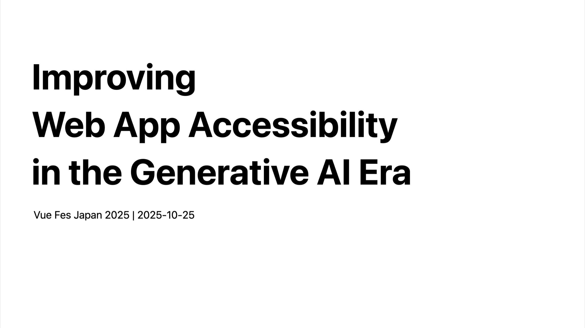

## Translation Articles

[English page](https://yamanoku.net/vuefes-japan-2025/en/) / [日本語ページ](https://yamanoku.net/vuefes-japan-2025/ja/)

---

At Vue Fes Japan Online 2022, I gave a presentation on [To make accessible components in Vue.js](https://vuefes.jp/2022/sessions/yamanoku), and at Vue Fes Japan 2023, I spoke about [How to make Nuxt applications accessible based on page transitions](https://vuefes.jp/2023/sessions/yamanoku).

This year at Vue Fes Japan, I'll be presenting about general web accessibility improvement methods that are not limited to Vue.js or Nuxt development.

## What is Web Accessibility?

Before diving into the main topic, I'd like to align our understanding of what "web accessibility" means.

"Accessibility" is often confused with "usability," but while usability refers to "ease of use in specific situations," accessibility refers to "the breadth of situations and the degree to which something can be used."

<figure>

![A diagram showing the difference between usability, which refers to ease of use in specific situations, and accessibility, which refers to the breadth of situations and degree of usability. The vertical axis represents the degree of usability (easier to use at the top, unusable at the bottom), and the horizontal axis represents user groups (target audience, able-bodied people, elderly people, people with disabilities, beginners, foreigners). The target audience and able-bodied people are positioned as easy to use, while other groups vary in their degree of difficulty.](../images/usability-accessibility.png)

<figcaption>Source: Sachi Majima, <a href="https://komatta-design.studio.site/">Design Solutions for Hard-to-See, Hard-to-Read "Oh No!" Moments [Revised Edition]</a> p.20</figcaption>
</figure>

The goal of accessibility is to elevate people in various situations—not just specific target audiences, but also elderly people, people with disabilities, beginners, foreigners, and others—from a state of "unable to use" to "able to use," enabling everyone to access and use it. Implementing this on the web is what we call web accessibility.

Actions that can be taken to achieve web accessibility include:

- Adding alternative text and labels for images
- Considering color contrast
- Making UI keyboard operable
- Making focus outlines visible
- Ensuring display doesn't break when zoomed
- Not auto-playing content or making it controllable
- Enabling motion reduction and high-contrast color adjustments from OS accessibility settings

How do we proceed with these? The guideline that serves as our compass is "<abbr title="Web Content Accessibility Guidelines">WCAG</abbr>."

WCAG is the Web Content Accessibility Guidelines developed by the W3C. The latest recommendation is WCAG 2.2 (recommended in December 2024). Based on four principles (perceivable, operable, understandable, robust), achievement criteria are defined at three levels (A, AA, AAA). It has been adopted as a legal standard overseas, and in Japan, the JIS standard (JIS X 8341-3:2016) is established as a national standard that is "technically equivalent" to WCAG.

<figure>

<figcaption>Source: Digital Agency <a href="https://www.digital.go.jp/resources/introduction-to-web-accessibility-guidebook">Web Accessibility Implementation Guidebook</a> (Date of establishment: October 16, 2025) p.16
</figcaption>
</figure>

An important point to share is that the current JIS standard is undergoing revision work and is scheduled to be updated to one based on WCAG 2.2. The international standard ISO was revised in September this year, and the new JIS is expected to be published around summer 2026. Therefore, when working on web accessibility from now on, **I recommend checking against WCAG 2.2 as the baseline**.

Traditional improvement methods included policy formulation based on WCAG achievement criteria, checking with assistive technologies, interviewing stakeholders, and providing accessibility-conscious design systems.

However, these require time-consuming preparation to get started, and there are probably many workplaces where it's difficult to proceed without experts. I've faced these challenges myself.

## Improving Web Accessibility Using Generative AI

Now let me introduce the main topic: "Improving Web Accessibility Using Generative AI."

<article style="border-width:1px; border-style:solid; border-color:var(--y-arcticle-border-color); padding-top:var(--y-rhythm-3); padding-left:var(--y-rhythm-3); padding-right:var(--y-rhythm-3);">

__Disclaimer__

This presentation introduces content based on the following conditions. Please be aware of this in advance.

- Survey and verification results as of October 2025
- Results may vary depending on model performance differences
- Mainly focuses on code improvement using AI agents

</article>

### Can AI Agents Write Accessible Code?

Before considering accessibility improvement using generative AI, I was curious: Can generative AI write accessible code in the first place? How much does it vary with prompt accuracy?

When I looked for information related to this theme, I found a [research paper on whether LLMs can generate accessible code](https://arxiv.org/abs/2503.15885), which I'll introduce.

This research compared and verified which had fewer accessibility violations: code written by humans or code generated by LLMs. The subjects chosen were actively updated and notable OSS website source codes. This included the [Vue.js official documentation site](https://vuejs.org/).

For violation verification, [IBM's Accessibility Checker](https://github.com/IBMa/equal-access) and [QualWeb](https://qualweb.di.fc.ul.pt/evaluator/) were selected as checking tools because they could detect more violations compared to other checking tools. Rules were checked based on WCAG 2.1 criteria.

Several methods were also proposed for prompt strategies (instruction methods):

- Naive: Simply generates code without any accessibility instructions
- Zero-Shot: Issues instructions to consider accessibility
- Few-Shot: Presents examples of correct and incorrect accessibility code before generation
- Self-Criticism: Reviews generated code for accessibility and performs one round of corrections

As a result of checking with these prompts, first, all methods resulted in lower accessibility violations compared to human-written code. But even more importantly, very significant insights were gained.

In fact, it was shown that **Naive—simply generating code without any accessibility instructions**—had the fewest accessibility violations. Conversely, **Few-Shot—presenting examples of correct and incorrect accessibility code before generation**—resulted in the most accessibility violations.

Why did this happen?

With Naive, basic web accessibility improvements, such as utilizing HTML and maintaining color contrast, seem to be performed without specific instructions. On the other hand, including accessibility-related content in the context clashed with the existing codebase structure and applied excessive accessibility information, resulting in more violations.

However, the Naive method alone doesn't solve web accessibility problems. Specifically, it couldn't handle complex accessibility requirements such as naming SVG elements and ensuring labels are unique.

Is there a way to improve accuracy from here?

To solve this problem, they created a new method called "FeedA11y." This utilizes a prompting framework called "Reason-Act (ReAct)" where LLMs repeat reasoning and action.

<figure>

<figcaption>Source: <a href="https://arxiv.org/abs/2503.15885">[2503.15885] Human or LLM? A Comparative Study on Accessible Code Generation Capability</a>
</figcaption>
</figure>

Let me introduce the FeedA11y mechanism.

First, based on the instructions, the "Generator LLM" generates clean code without including accessibility instructions.

Next, another LLM called the "Optimizer LLM" reviews that code and creates an "Accessibility Report."

Then that content is fed back to the Generator, prompting corrections. This cycle is repeated about 2-3 times.

This succeeded in producing the fewest accessibility violations compared to existing prompts.

The useful method learned from this research result is **not including accessibility instructions during code generation, but repeating review and correction after generation**.

### Creating Test Cases and Reports with Generative AI

Since we've learned that thorough review is more important than generating accessible code from the start, let's create test cases for reviewing using generative AI.

Generating check sheets like the example from Gaudiy is useful. In this example, it seems possible to confirm which checklist items are filled based on WCAG achievement criteria. Have generative AI read WCAG achievement criteria, list what's needed, and generate your own check sheet.

To further enhance test case specificity, you might try using "[Inclusive Persona Extension](https://github.com/caztcha/Inclusive-Persona-Extension)," a design support tool that prepares test cases with personas of stakeholders.

This connects to accessibility awareness in projects by adding the context of personas of people with disabilities in the design process of websites and web applications.

For example, regarding the "Visual Disability (Total Blindness)" persona, their barriers include contexts such as "cannot understand visual information," "requires screen reader," and "keyboard operation is essential."

Based on this persona, let me introduce test cases generated with Playwright Agent. For example, for "Page load and basic landmark (header, main, etc.) existence confirmation," test cases can be generated that include preconditions, steps, expected results, success criteria, and failure criteria.

### WAI-ARIA

Now, we've looked at how to use AI so far, but there's one thing to be most careful about in improving web accessibility.

That is **<abbr title="Web Accessibility Initiative - Accessible Rich Internet Applications">WAI-ARIA</abbr>**.

WAI-ARIA is a technical specification that supplements accessible information that cannot be expressed with HTML alone for assistive technologies like screen readers. WAI-ARIA plays a role in supplementing the accessibility tree.

Use cases for WAI-ARIA include utilizing it for complex UIs that cannot be expressed with HTML elements alone, their state changes, and dynamic notifications like form validation. It may also be used to override situations where HTML structure cannot be changed.

As mentioned in the earlier research, generative AI makes many mistakes when implementing complex accessibility requirements, especially those related to WAI-ARIA.

This is because generative AI may not correctly understand or learn the use cases and implementation methods of ARIA that align with the code's "context." These mistakes are similar to failures seen when humans who don't properly understand WAI-ARIA write code, so I think it's an understandable result.

As countermeasures, preparing <abbr title="Retrieval-Augmented Generation">RAG</abbr> based on WAI-ARIA specifications or utilizing <abbr title="Model Context Protocol">MCP</abbr> that understands specifications can be considered.

This time, I'll focus on utilizing MCP servers that can be immediately put into practice.

### Using MCP Servers to Reduce Mistakes

I created "[aria-validate-mcp-server](https://github.com/yamanoku/aria-validate-mcp-server)," an ARIA validation MCP server that can handle correct WAI-ARIA information.

<figure>
  
</figure>

This internally uses the aria-query library used in accessibility ESLint Plugins. It can check which values roles, attributes, and ARIA attributes that correspond to WAI-ARIA 1.2 specifications can handle.

For example, if you ask "What values can the `checkbox` role handle?", it will return a correct answer based on specifications: "The required attribute is `aria-checked`, and values are `true`, `false`, `mixed`."

By incorporating such knowledge as an MCP server, the aim is to prevent incorrect ARIA implementation.

ID attribute management required when using WAI-ARIA is also important. Rather than leaving generation to AI, it's better to instruct it to utilize APIs provided by each framework that generate unique IDs. React, Vue.js, and Svelte have corresponding APIs. Let's instruct them to use these in advance, such as in AGENTS.md.

- React: [https://react.dev/reference/react/useId](https://react.dev/reference/react/useId)
- Vue.js: [https://vuejs.org/api/composition-api-helpers#useid](https://vuejs.org/api/composition-api-helpers#useid)
- Svelte: [https://svelte.dev/docs/svelte/$props#$props.id()](https://svelte.dev/docs/svelte/$props#$props.id())

The decision of "whether to use WAI-ARIA or handle with modern HTML/CSS" is also important.

While WAI-ARIA is important for providing accessible information, it's more important to be able to express things without using it, with HTML/CSS.

For this purpose, I've also created "[baseline-mcp-server](https://github.com/yamanoku/baseline-mcp-server/)," which can check Baseline information to know which Web APIs can be stably used in modern browsers.

<figure>
  
</figure>

Since the usage environment differs for each company's products, please consult with the browser range handled by each product and investigate whether the presented HTML/CSS can be applied.

When WAI-ARIA is used, it's also necessary to check how it actually affects the accessibility tree. For example, whether content is unintentionally hidden by `aria-hidden` depends on the situation and cannot be determined just by looking at the code.

To check this content, let's use [Playwright MCP](https://github.com/microsoft/playwright-mcp). One revolutionary aspect of Playwright MCP is that it executes by looking at the accessibility tree. This can be utilized to check what the overall accessible names are and what the relationships between elements are.

Incidentally, the recently announced [Chrome DevTools MCP](https://github.com/ChromeDevTools/chrome-devtools-mcp) does not yet have the ability to read the accessibility tree[^1]. Therefore, I recommend using Playwright MCP.

[^1]: [Accessibility tree/element(s) snapshot - exposing semantics, roles, states, ARIA,... · Issue #363 · ChromeDevTools/chrome-devtools-mcp](https://github.com/ChromeDevTools/chrome-devtools-mcp/issues/363)

Playwright MCP can also be utilized for accessibility checking from an E2E testing perspective, such as checking with keyboard operation (tab key transitions) and checking focus order.

### Linter & Tests as Guardrails

And of course, rather than relying only on generative AI, it's important to also set up traditional guardrails—linters and tests.

Don't forget to check accessibility with various ESLint Plugins, Biome, Oxlint, etc.

For React, [eslint-plugin-jsx-a11y](https://www.npmjs.com/package/eslint-plugin-jsx-a11y), for Vue.js, [eslint-plugin-vuejs-accessibility](https://www.npmjs.com/package/eslint-plugin-vuejs-accessibility), for Svelte, [svelte-check](https://www.npmjs.com/package/svelte-check),

Also utilize [Markuplint](https://www.npmjs.com/package/markuplint) for HTML linting, and use [@axe-core/playwright](https://www.npmjs.com/package/@axe-core/playwright) for E2E testing to check the quality of generated code.

### Summary of Web Accessibility Improvement Using Generative AI

Let me summarize what has been presented so far.

- The method (ReAct) of not including accessibility instructions during code generation but repeating review and correction after generation is effective
- Having AI understand test cases based on personas and conducting thorough reviews
- For WAI-ARIA, which generative AI struggles with, provide correct information (specifications) from outside via RAG or MCP to reduce defects
- Playwright MCP, which can check the accessibility tree, is useful
- Don't forget to also set up guardrails with linters and tests

By being conscious of these methods, you can expect highly accurate web accessibility improvement using generative AI. Please use this as a reference for tomorrow's development.

## Conclusion

So far, I've talked about specific techniques for using generative AI to streamline accessibility improvement.

Finally, I'd like to talk about what I think regarding generative AI and accessibility.

Deque, which develops axe—an indispensable tool for modern web accessibility improvement—has also announced the "[Axe AI](https://www.deque.com/axe/ai/)" project, which relates accessibility checking with AI. They're developing axe MCP servers, AI-equipped axe DevTools Extensions, and axe Assistant, which can consult on accessibility-related matters by linking with chat tools like Slack.

Deque aims for the following regarding the future of accessibility testing:

> "100% accessibility testing enabled for novices."[^2]

[^2]: [Automation Gains: Increasing what can be automated in accessibility testing - axe-con](https://www.deque.com/axe-con/sessions/automation-gains-increasing-what-can-be-automated-in-accessibility-testing/)

This doesn't mean 100% test automation, but aims to shorten the time spent on accessibility improvement and make work easier.

As someone who thinks about web accessibility improvement, I have expectations for tool development that considers such efficiency.

AI's evolution is tremendous, and you might think that if we leave everything to AI, accessibility problems will be solved. In fact, products like [Be My Eyes](https://www.bemyeyes.com/) exist that relate AI to problem-solving for people with disabilities. I also hear voices saying that chat UIs might make all other UIs unnecessary.

But is that really okay?

I don't think chat UIs alone can handle everything. Skills are also needed to give AI instructions as intended. Experience that leads to understanding through touching and operating things yourself is also necessary.

What's important here, I believe, is being able to prepare "options" that can be used—whether through direct operation or AI-assisted operation. There will continue to be parts that become easier with AI and parts that don't.

The generative AI techniques I introduced today are just about "means."

What we should return to is the "intent" part: "Why do we do accessibility?" and "What are we providing to whom?" Only humans can think about this intent.

We need to utilize generative AI while acquiring correct knowledge about accessibility and being able to turn that improvement cycle throughout the organization.

Generative AI has the potential to dramatically lower the barriers to accessibility improvement.

By having this powerful "weapon" in hand, and by having developers face it with knowledge of accessibility and the "intent" of what to create, I think this will lead to truly accessible web applications.

With generative AI as our weapon, let's create accessible things together with everyone here.

## Acknowledgments

### LLM Models, Services & Software Used in Creating This Presentation

- Claude Sonnet 4.5, Claude Ops 4, Gemini 2.5 Pro, GPT-5
- NotebookLM, Google Gemini, Claude Desktop, Claude Code, Codex CLI

### Reviewers of This Presentation

[haribooooom](https://x.com/haribooooom), [hk_it7](https://x.com/hk_it7), [kubosho](https://x.com/kubosho_), [magi1125](https://x.com/magi1125), [takanorip](https://x.com/takanoripe), [ymrl](https://x.com/ymrl)

## References

* [困った！を解決するデザイン](https://komatta-design.studio.site/)
* [ウェブアクセシビリティ導入ガイドブック｜デジタル庁](https://www.digital.go.jp/resources/introduction-to-web-accessibility-guidebook)
* [JIS X 8341-3の改正に関する準備──ウェブアクセシビリティ基盤委員会 作業部会6 | ウェブアクセシビリティ基盤委員会（WAIC）](https://waic.jp/news/ciaj-column-13/)
* [アクセシビリティBlog | ナレッジ | ミツエーリンクス](https://www.mitsue.co.jp/knowledge/blog/a11y/)
* [Accessible & Usable](https://accessible-usable.net/)
* [AIとマークアップ｜magi1125](https://note.com/magi1125/n/n1296f9168104)
* [ウェブアクセシビリティと生成AI - NotebookLM](https://notebooklm.google.com/notebook/e06d062b-2650-467d-86e7-ec9f4fa0e65b?authuser=1)
* [Advancing AI for axe: The next leap in digital accessibility | Deque](https://www.deque.com/blog/advancing-ai-for-axe-the-next-leap-in-digital-accessibility/)
* [noriyuki-shimizu/a11y-test-mcp](https://github.com/noriyuki-shimizu/a11y-test-mcp)
* [Introducing Accessibility MCP Server | LambdaTest](https://www.lambdatest.com/support/docs/accessibility-mcp-server/)
* [Automating Web Accessibility Testing with AI Agents - Speaker Deck](https://speakerdeck.com/maminami373/automating-web-accessibility-testing-with-ai-agents)
* [Improving Accessibility Leveraging Large Language Models - Sheri Byrne-Haber (A11yTalks - GAAD 2024) - YouTube](https://www.youtube.com/watch?v=5wdNcy7yPCc)
