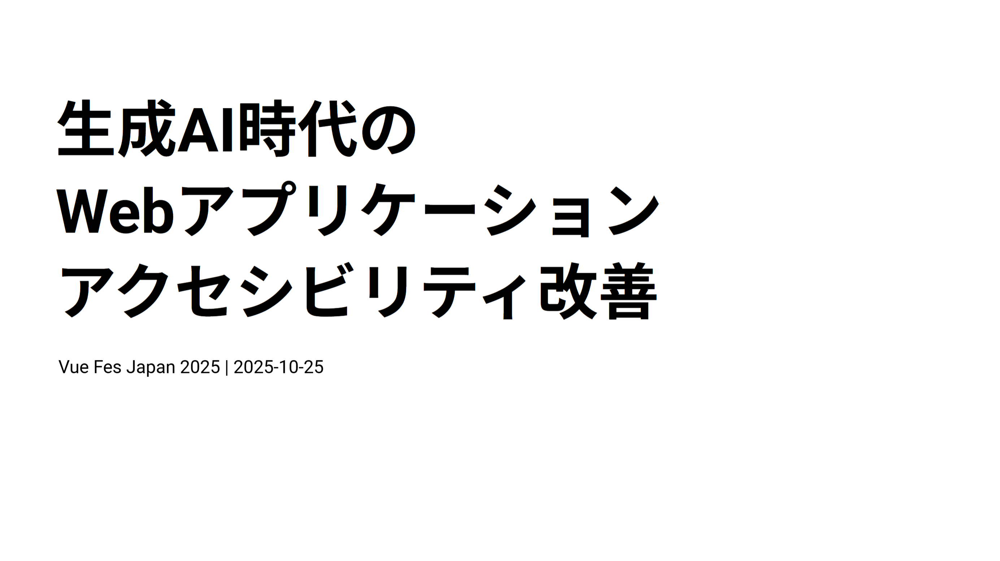
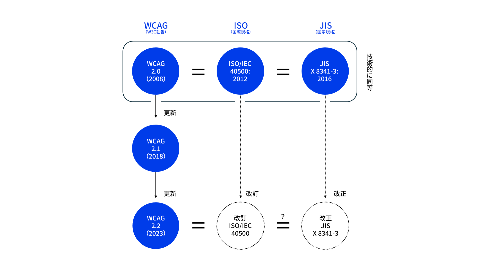
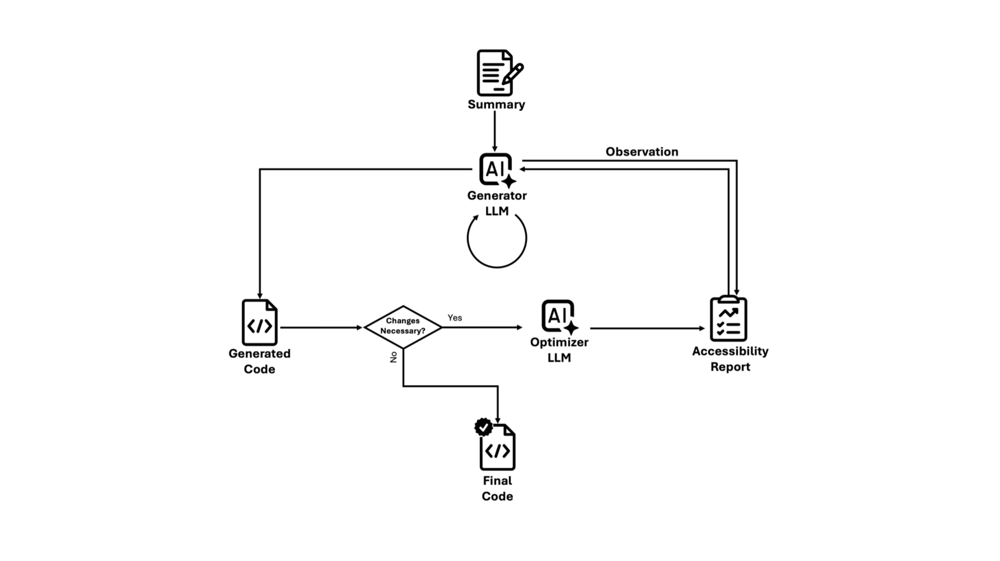

## 翻訳記事一覧

[日本語ページ](https://yamanoku.net/vuefes-japan-2025/ja/) / [English page](https://yamanoku.net/vuefes-japan-2025/en/)

---

Vue Fes Japan Online 2022では[Vue.jsでアクセシブルなコンポーネントをつくるために](https://vuefes.jp/2022/sessions/yamanoku)という発表、Vue Fes Japan 2023では[画面遷移から考えるNuxtアプリケーションをアクセシブルにする方法](https://vuefes.jp/2023/sessions/yamanoku)話をさせていただきました。
今年のVue Fes Japanでは、Vue.jsやNuxtだけの開発に限らない汎用的なWebアクセシビリティ改善手法についてを発表していきます。

## Webアクセシビリティとは

本題に入る前に、まず「Webアクセシビリティ」とは何か、前提を揃えたいと思います。

「アクセシビリティ」は、よく「ユーザビリティ」と混同されがちですが、ユーザビリティが「特定の状況での使いやすさ」を指すのに対し、アクセシビリティは「使える度合いや状況の幅広さ」を指します。

ターゲット層だけでなく、高齢者、障害者、初心者、外国人など、様々な状況の人が「使えない」状態から「使える」、さらには「使いやすい」状態に引き上げることがアクセシビリティの目的です。そしてそれをWebで実現していくことがWebアクセシビリティと呼ばれるものです。

Webアクセシビリティを実現するために対応できるということは以下のものが挙げられます。

- 画像への代替となるテキストやラベルを挿入
- カラーコントラストへの配慮
- UIのキーボード操作を可能にする
- フォーカスアウトラインの可視化
- 拡大表示しても画面表示が崩れない
- コンテンツの自動再生をさせない・制御できるようにする
- OSのアクセシビリティ設定から動きの軽減、ハイコントラストのカラー調整ができる

これらをどう進めるか。その指針となるのが「<abbr title="Web Content Accessibility Guidelines">WCAG</abbr>」です。

WCAGは、W3Cが策定する国際的なアクセシビリティのガイドラインです。4つの原則（知覚可能、操作可能、理解可能、堅牢）と3つの達成レベル（A, AA, AAA）が定められています。日本では、JIS規格（JIS X 8341-3:2016）が、このWCAGと「技術的に同等」の国家規格として定められています。

重要なのは、現在のJIS規格はWCAG 2.0がベースですが、現在改正作業が進んでおり、WCAG 2.2をベースにしたものに更新される予定であるということです。新しいJISは2026年夏ごろに公示される見込みです。ですので、これからWebアクセシビリティに取り組む場合は**WCAG 2.2をベースとしてチェックすることをお勧めします**。

従来の改善方法は、WCAGの達成基準に基づいた方針策定、支援技術でのチェック、当事者インタビュー、アクセシビリティに配慮されたデザインシステムとして提供するなどがありました。

しかしこれらには始めるための準備に時間がかかり、なかなか手がつけられなかったり、専門家が居ないと進めづらいという現場も多いのではないでしょうか。私自身もその悩みとぶつかることがありました。

## 生成AIを活用したWebアクセシビリティ改善

今回のテーマである「生成AIを活用して、より効率的にアクセシビリティ改善ができないだろうか？」について紹介していきます。

<article style="border-width:1px; border-style:solid; border-color:var(--y-arcticle-border-color); padding-top:var(--y-rhythm-3); padding-left:var(--y-rhythm-3); padding-right:var(--y-rhythm-3);">

__おことわり__

今回の発表では以下の条件に基づいた内容を紹介します。あらかじめご了承ください。

- 2025年10月時点での調査・検証結果の紹介
- モデル性能差によって結果に差異がある可能性はあります
- 独自で検証したものもありケースによっては適応できない可能性もあります
- 主にAIエージェントを活用したコード観点での紹介

</article>

### 生成AIはアクセシブルなコードを書ける？

どのように改善できるかを考える前に、そもそも生成AIはアクセシブルなコードを書くことができるのか、プロンプトの精度でどれくらい変わるのか？というのが気になりました。

このテーマに関連しそうな情報を探してみたところ、[LLMはアクセシブルなコードを生成できるのかを研究した論文](https://arxiv.org/abs/2503.15885)が見つかりましたので紹介いたします。

この研究では、人間が書いたコードとLLMが生成したコードとでどちらがアクセシビリティ違反が少ないかを比較・検証しました。対象となったのは現在進行形で更新があり、注目されているOSSのWebサイトソースコードが選ばれました。この中にはVue.jsの公式ドキュメントサイトも選ばれています。

違反の検証として[IBMのアクセシビリティチェッカー](https://github.com/IBMa/equal-access)と[QualWeb](https://qualweb.di.fc.ul.pt/evaluator/)というチェックツールが選ばれました。これは他チェックツールと比較して多くの違反を検出できるものだったからです。ルールはWCAG2.1を基準としてチェックが行われました。

プロンプト戦略（指示の出し方）についてもいくつかの手法を提案しています。

- Naive: 特にアクセシビリティの指示を与えず単純にコード生成を行う
- Zero-Shot: アクセシビリティに配慮するように指示を出す
- Few-Shot: アクセシビリティにまつわる正誤コード例を提示してから生成を行う
- Self-Criticism: 生成したコードをアクセシブルかレビューし、１回修正を行う

これらのプロンプトで確認した結果として、非常に重要な示唆が得られました。実は **Naiveの特にアクセシビリティの指示を与えず単純にコード生成を行う** という仕組みが最もアクセシビリティ違反が少ないことが示されました。逆に **Few-Shotのアクセシビリティにまつわる正誤コード例を提示してから生成を行う** が最もアクセシビリティ違反の多い結果となっています。

なぜこのような結果となったのか。Naiveでは基本的なWebアクセシビリティ改善、例えばHTMLを活用することやカラーコントラストの整備などは具体的な指示をせずとも行ってくれるようです。一方、アクセシビリティにまつわる内容をコンテキストを含めることで既存のコードベースの構造と衝突し、過剰なアクセシビリティ情報を適用して違反が逆に増えてしまったというのが挙げられています。

ただ、Naiveの手法があるだけでWebアクセシビリティの問題が改善できているわけではありません。具体的にはSVGへの名前付けやラベルが一意であるようにするなど、複雑なアクセシビリティ要件には対応しきれていませんでした。

そこでその問題を解消するために「FeedA11y」という新しいプロンプトのフレームワークを作成しました。これは「Reason-Act（ReAct）」と呼ばれる、LLMが推論と行動を繰り返すプロンプトのフレームワークです。

FeedA11yの仕組みについて紹介します。まず「Generator LLM」が、あえてアクセシビリティの指示を含めずにクリーンなコードを生成します。

次に「Optimizer LLM」という別のLLMが、そのコードをレビューし、「Accessibility Report」を作成します。不備があればGeneratorにフィードバックが送られ、修正を促すというこのサイクルを約2〜3回繰り返していきます。

これによって既存のプロンプトよりも最もアクセシビリティ違反が少ない結果を出すことに成功しました。

この結果から得られる有用な手法として**コード生成時にはアクセシビリティの指示を含めず、生成後にレビューと修正を繰り返す**というのが分かりました。

### レビューをしていくための手法

レビューをすることが大事、ということがわかったので生成AIを活用してレビューするためのテストケースを作成していきます。

Gaudiy社の例のように、統一されたフォーマットでチェックシートを生成させておくと生成AIが作業する上で有用です。この場合はWCAGの達成基準を元にどのチェックリストが埋められているかを確認できるようになっています。生成AIに達成基準を読み込ませて確認で必要なものをリストアップしてもらい独自のチェックシートを生成しておきましょう。

さらにテストケースの具体性を高めるために、当事者のペルソナを設定したテストケースを用意した「インクルーシブなペルソナ拡張」というものを使ってみてもよいかもしれません。

例えば「視覚障害（全盲）」のペルソナについて。彼らの障壁は「視覚情報が理解できない」「スクリーンリーダーが必要」「キーボード操作が必須」などです。

このペルソナに基づき、AIに「シナリオ 1: ページ読み込みと基本ランドマーク（header, mainなど）の存在確認」 や、「シナリオ 2: 文字のぼやけを想定し、フォントサイズを150%にしても可読性があるか」といったテストケースを実行させることができます。

### WAI-ARIA

さて、ここまでAIの活用法を見てきましたが、Webアクセシビリティの改善において最も気をつけるべき点があります。

それが **<abbr title="Web Accessibility Initiative - Accessible Rich Internet Applications">WAI-ARIA</abbr>** です。

WAI-ARIAは、スクリーンリーダーといった支援技術に対してHTMLだけでは表現しきれないアクセシブルな情報を補完する技術仕様です。WAI-ARIAはアクセシビリティツリーを補完する役割を持ちます。

WAI-ARIAを使う事例として、HTML要素だけでは表現しきれない複雑なUIやその状態変化、フォームバリデーションのような動的な通知を行う際に活用します。またHTML構造が変えられない状況において、上書きすることもあったりします。

さきほどの研究でも紹介がありましたが、生成AIは複雑なアクセシビリティ要件、特にWAI-ARIAにまつわる実装をさせると誤りが多くなります。これは生成AIがコードの「文脈」に沿ったARIAのユースケースや実装方法を正しく理解・学習できていない可能性があるからです。この誤りはWAI-ARIAを正しく理解できていない人間がコードを書く際にも同じような失敗は見受けられるため、納得できる結果かと思っています。

この対策として、WAI-ARIAの仕様書をベースとしたRAG（Retrieval-Augmented Generation）を用意することや、仕様を理解したMCPを活用することが考えられます。今回はすぐ実践できるMCPサーバーの活用についてを取り上げてみます。

### MCPサーバーを活用して間違いを減らす

正しいWAI-ARIAの情報を取り扱うことのできるARIAバリデーション用MCPサーバーの「aria-validate-mcp-server」を作ってみました。

これはアクセシビリティのESLint Pluginで使用されているaria-queryというライブラリを内部で用いています。WAI-ARIA 1.2の仕様に対応したroleや属性やARIA属性が、どの値を扱えるかをチェックすることができます。

例えば「`checkbox`ロールが扱える値は？」と聞くと、「必須属性は`aria-checked` で、値は`true`,`false`,`mixed`です」と、仕様に基づいた正しい答えを返してくれるようになります。こうした知識をMCPサーバーとして組み込むことで、間違ったARIAの実装を防ぐねらいがあります。

WAI-ARIAを使用する際に必要となるID属性の管理も重要です。これはAIに生成を任せるのではなく、各フレームワークが提供する一意のIDを生成するAPIを活用するように指示するほうが向いています。React、Vue.js、Svelteにはそれ相当のAPIが存在しています。これらを活用するよう、AGENTS.mdなどに事前に指示しておきましょう。

- React: [https://ja.react.dev/reference/react/useId](https://ja.react.dev/reference/react/useId)
- Vue.js: [https://ja.vuejs.org/api/composition-api-helpers#useid](https://ja.vuejs.org/api/composition-api-helpers#useid)
- Svelte: [https://svelte.jp/docs/svelte/$props#$props.id()](https://svelte.jp/docs/svelte/$props#$props.id())

また「WAI-ARIAを使うべきか、最新のHTML/CSSで対応すべきか」の判断も重要です。そのためにモダンブラウザでどのWeb APIが安定して使用できるかを知る「Baseline」の情報を確認できるMCPサーバーも作成してみています。各社プロダクトでの利用環境は異なると思うので、プロダクトごとでの扱うブラウザ範囲と相談しつつ、提示されたHTML/CSSが適応できるかどうかを調べてみてください。

WAI-ARIAを使った場合は実際にアクセシビリティツリーがどう影響しているかをチェックすることも必要です。例えば`aria-hidden`によって意図せずコンテンツが消えていないかというのは、状況にもよるためコードだけ見ても良いか悪いかが分かりません。

この内容を確認するためにPlaywright MCPを使用しましょう。Playwright MCPの画期的なものの１つとしてアクセシビリティツリーを見て実行しているという点があげられます。これを活用し、全体のアクセシブルネームがどうなっているか、要素同士の関係性がどうなっているかをチェックすることができます。

ちなみに最近発表されたChrome DevTools MCPにはまだアクセシビリティツリーを読み取る機能が備わっていません。そのためPlaywright MCPを使用することをお勧めします。

ほかにもPlaywright MCPではキーボード操作（タブキー遷移）でのチェックやフォーカス順序の確認 など、E2Eテスト観点でアクセシビリティのチェック指示が可能なので活用していきましょう。

### ガードレールとしてのLinter

そしてもちろん生成AIだけに頼るのでなく、従来からのガードレール、つまりLinterとテストも設定しておくことが重要です。

Reactであればeslint-plugin-jsx-a11y、Vue.jsであればeslint-plugin-vuejs-accessibility、Svelteはコンパイラとしてのsvelte-check、出力されたHTMLにはMarkuplint、E2Eテストでは@axe-core/playwrightなどを活用し、生成されたコードの品質チェックをしていきましょう。

### 生成AIによるWebアクセシビリティ改善まとめ

ここまでで発表してきた内容をまとめていきます。

1. コード生成時はアクセシビリティ指示を含めず、生成後にレビュー・修正を繰り返す手法（ReAct）が有効
2. ペルソナに基づいたテストケースをAIに理解させ、レビューを入念に行う
3. 生成AIが苦手なARIAは、RAGやMCPで正しい情報（仕様）を外部から与え、不備をなくす
4. アクセシビリティツリーをチェックできるPlaywright MCPは有用
5. Linterやテストによるガードレールも忘れずに設定する

これらの手法を意識することで、生成AIによる精度の高いWebアクセシビリティ改善が期待できます。ぜひ参考にして明日からの開発に生かしていただきたいです。

## おわりに

現代のWebアクセシビリティ改善でなくてはならない存在であるaxe-coreの開発するDeque社もアクセシビリティチェックとAIと関連させた「Axe AI」プロジェクトを発表しています。

Deque社が掲げる将来のビジョンは「専門家でなくても100%のアクセシビリティテストを可能にすること」です。これはかなり野心的な挑戦だと感じており、Webアクセシビリティの改善を考える同じ立場のものとして期待しているところはあります。

AIの進化は凄まじく、AIにすべて任せればアクセシビリティ問題は解決するのでは？と思うかもしれません。実際Be My EyesのようなAIと障害当事者への問題解決に関連するプロダクトは存在しています。

ですが、本当にそのままでよいのでしょうか？

チャットUIによってほか全てのUIは不要になるかというと私はそうは思いません。AIへの意図通りの指示にもスキルが必要です。

ここで重要となるのは、**直接の操作でも、AIによる操作でも、使える「選択肢」を用意できること**だと私は考えます。AIによって楽になる部分とそうでないものは存在し続けていくと思います。

生成AIで対応を楽にすることは、あくまで「手段」です。私たちが立ち返るべきは、「なぜアクセシビリティをやるのか？」「誰に何を提供しているのか？」という「意図」の部分です。この意図を考えるのは、人間にしかできません。

私たちは生成AIを活用しながら、アクセシビリティに関する正しい知識を身につけていきながら、組織全体でその改善サイクルを回していけるようにする必要があります。

生成AIを「武器」として使いこなし、アクセシブルなものを皆で共に作っていきましょう。

## 参考資料

* [困った！を解決するデザイン](https://komatta-design.studio.site/)
* [ウェブアクセシビリティ導入ガイドブック｜デジタル庁](https://www.digital.go.jp/resources/introduction-to-web-accessibility-guidebook)
* [JIS X 8341-3の改正に関する準備──ウェブアクセシビリティ基盤委員会 作業部会6 | ウェブアクセシビリティ基盤委員会（WAIC）](https://waic.jp/news/ciaj-column-13/)

