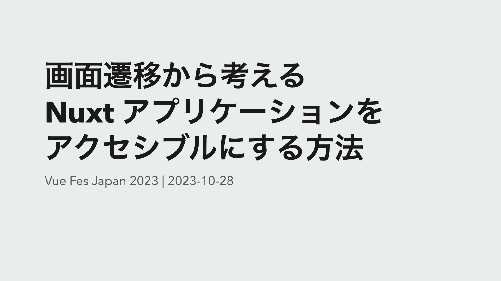
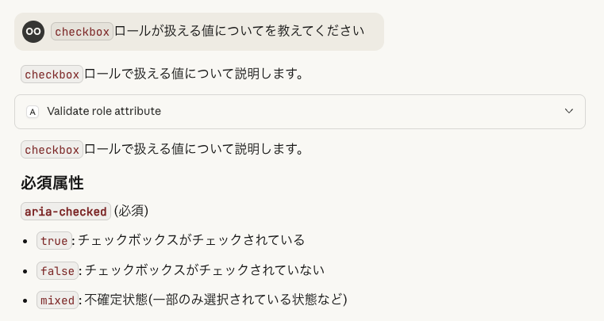
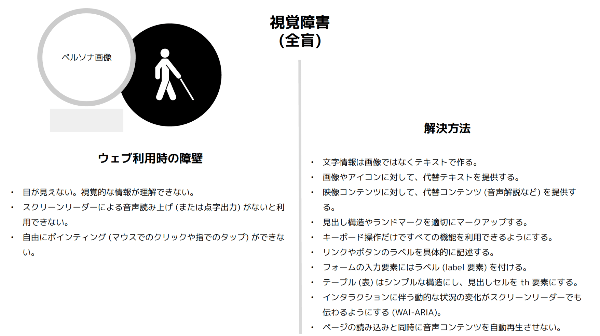
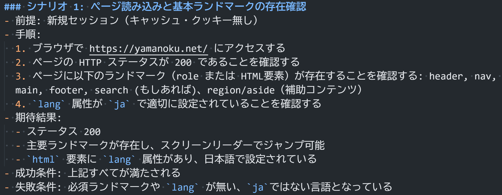

---
# try also 'default' to start simple
theme: apple-basic
layout: intro
# some information about your slides (markdown enabled)
title: 生成AI時代のWebアプリケーションアクセシビリティ改善
mdc: true
transition: fade
fonts:
  sans: Roboto, "Noto Sans JP"
---

<h1 mt="12">生成AI時代の Webアプリケーション アクセシビリティ改善</h1>

Vue Fes Japan 2025 | <time datetime="2025-10-25">2025-10-25</time>

  
    yamanoku
  

---
layout: center
---

  
  
  
  
  Vue Fes Japan Online 2022での発表資料
  
  Vue Fes Japan 2023での発表資料

---
layout: center
---

  

<small>
  出典：間嶋 沙知「見えにくい、読みにくい「困った！」を解決するデザイン【改訂版】」p.20
</small>

---
layout: center
---

# 今日のWebアクセシビリティに関する状況・情報

---
layout: section
---

## Web Almanac 2024のアクセシビリティ

---
layout: section
---

## Web Almanac 2024のアクセシビリティ要約

- Lighthouse のアクセシビリティスコア中央値は 84% に上昇
- alt属性ありのサイトは69%
    - ただし値が空であったり短すぎる値やファイル名のままの値だったりする
- 7割以上のサイトが十分なコントラストの確保で基準が未達
- 動画・音声コンテンツのアクセシビリティ確保はほぼゼロの状態
- アクセシビリティオーバーレイの問題点について

以前の調査結果より改善傾向にあるが大幅に何かが変わったわけではない。

<b>アクセシビリティをゴールとしないことが肝要。</b>

---
layout: center
---

  

<small>
出典：Web Almanac 2024: Accessibility - Most Accessible JavaScript Frontend UI Frameworks.
</small>

---
layout: center
---

  

<small>
出典：Web Almanac 2024: Accessibility - Most Accessible JavaScript Meta-frameworks.
</small>

---
layout: section
---

## 欧州アクセシビリティ法（EAA）の施行

- 2025年6月28日より完全施行（2019年に公布・採択）
- EU市場において販売、提供されるさまざまなデジタル製品・サービスを、障害者にとってアクセシブルなものとするための法律
    - EN 301 549という欧州規格への適応
- 日本国内にあっても、EU加盟国においてデジタル製品・サービスを販売している企業であれば、EAAの適用対象となる可能性がある

---
layout: section
---

## WCAG 2.2がJIS X 8341-3へ適応される予定

- JIS（日本工業規格）におけるウェブコンテンツのアクセシビリティにまつわる国家規格がJIS X 8341-3:2016
- WCAG 2.0をベースに2016年に改定されて以来更新がなかった
- 国際規格が今年見直され、WCAG2.2をベースとしてISO/IEC DIS 40500として規格化
- JIS規格側もこの変更に併せて更新を進めている
    - [JIS X 8341-3の改正に関する準備──ウェブアクセシビリティ基盤委員会 作業部会6 | ウェブアクセシビリティ基盤委員会（WAIC）](https://waic.jp/news/ciaj-column-13/)

---
layout: center
---

  

<small>
出典：デジタル庁 ウェブアクセシビリティ導入ガイドブック（2024年3月29日発行）p.16
</small>

---
layout: section
---

## 徐々にWCAG2.2へ移行していく準備をしておく

- これからアクセシビリティに取り組む場合はWCAG2.0からスタートし、WCAG2.1、WCAG2.2の改定されたものへ徐々に移行していく
- 現在の規格への対応作業を行うことで、将来の規格にも円滑に対応できるようになる
- 廃止される基準（4.1.1）については除いておくようにする
    - なおJIS X 8341-3:2016への準拠する場合はチェックする対象となる
- axe-coreのタグについてはまだWCAG 2.2レベルA準拠のものはないことに注意

---
layout: center
---

# 生成AIによるWebアクセシビリティ改善

---
layout: section
---

## おことわり

- 2025年10月時点での調査・検証結果の紹介
- モデル性能差によって結果に差異がある可能性はあります
- 独自で検証したものもありケースによっては適応できない可能性もあります
- 主にAIエージェントを活用したコード観点での紹介
    - Figmaなどのデザインツール連携については今回は取り扱わないものとする

---
layout: statement
---

# AIエージェントで アクセシブルなコードは どう実現できる？

---
layout: center
class: bg-[#17191e]
---

---
layout: statement
---

# アクセシビリティを 気を付ける旨のプロンプトは 本当に有用なのか？

---
layout: section
---

## LLMはアクセシブルなコードを生成できるか？という研究

  

<small>
  <a href="https://arxiv.org/abs/2503.15885">[2503.15885] Human or LLM? A Comparative Study on Accessible Code Generation Capability</a>
</small>

---
layout: section
---

## LLMによる性能比較手法

- 現在進行形で更新がされている注目されているウェブサイトを10件選定
- コードブロックごとで要約（HTMLは構造タグ、JSは関数やクラスごと、CSSは宣言ブロック）
- 要約内容を元にウェブサイトのコードを再生成する
- 使用したLLMモデルはGPT-4o、Qwen2.5-Coder
- WCAG 2.1のガイドラインを基にAChecker＆QualWeb Accessibility Toolというツールで評価

---
layout: section
---

## 研究結果

特にアクセシビリティにまつわるプロンプトを指示しない状態で人が書いたコードよりも違反が少ない状態で生成できた。

カラーコントラストや代替テキストの挿入、フォームのラベル付けといった基本的なアクセシビリティ要件への対処ができているようになった。

<b>生成AIは何も指定しなくとも正しくHTML要素を使ってくれることが証明された。</b>

---
layout: statement
---

<h1>無指示でも 
アクセシビリティを 
意識して 
実装してくれる</h1>

---
layout: statement
---

<h1>😄</h1>

---
layout: statement
---

<h1>本当に大丈夫…？</h1>

---
layout: section
---

# 生成AIによる改善の課題点 それに対する解決策

---
layout: statement
---

<h1>WAI-ARIA</h1>

---
layout: section
---

## WAI-ARIAとは何か

<small>出典：Accessibility Object Model p.4</small>

---

# WAI-ARIAを活用しないといけない状況

- HTML要素のみでは表現しきれない場合
  - 複雑なUIを表現する場合
  - 提供する環境によって使えないものもある可能性
- 元のHTML構造を変更できない、リファクタリングなどができない場合
  - WAI-ARIAによって要素の意味合いを変える
- しかし生成AIはWAI-ARIAを実装をさせると誤った実装が見られることがある
- "No ARIA is better than Bad ARIA"
    - 「悪いARIAよりもARIAなしの方が良い」

---

## 間違ったWAI-ARIAを使わないようにする

- `aria-label`で本来伝えたかった情報が上書きされる
- `aria-hidden`によりコンテンツが意図されずに隠されてしまっている
- `aria-live`がassertiveとなって通知が差し込まれるようになっていないか
- `aria-labelledby`で参照するIDが存在しないことがある、等

---
layout: statement
---

# FeedA11y

---
layout: section
---

## FeedA11yの仕組み

---

## 改善のサイクルを回す仕組みづくり

- LLMが推論して、再度行動をすることで高い精度が得られるようになる手法
    - Reason-Act（ReAct）と呼ばれるもの
- プロンプトにアクセシビリティ準拠指示を出す、正誤コード例を提示する、レビューされたのちに修正1回だけする、という指示よりも成果があった
- 正誤コード例を提示する手法がもっとも悪い結果になった
- ただし微妙なARIAの制約や意味論の部分で正確性を欠くことはある

<b>Vibe Codingのみでは完全に正確にARIAを扱えるわけではない</b>

---
layout: statement
---

# MCPを活用する

---
layout: section
---

## MCP（Model Context Protocol）

<small>出典：What is the Model Context Protocol (MCP)? - Model Context Protocol</small>

---

## aria-validate-mcp-server

- aria-queryを活用したARIAのバリデーション用MCPサーバー
- role、ARIA属性のそれぞれを取得できる
- 対応できる値をチェックできる
  - 要素に対応する属性と値は何か
- WAI-ARIA 1.2対応

[https://github.com/yamanoku/aria-validate-mcp-server](https://github.com/yamanoku/aria-validate-mcp-server)

---
layout: center
class: bg-[#faf9f5]
---

  

---

## ID属性管理はライブラリのAPIを活用させる

- WAI-ARIAで活用するためのID自体が被ってしまう可能性がある
- 各ライブラリには一意のIDを生成するAPIが搭載されている
    - React: https://ja.react.dev/reference/react/useId
    - Vue.js: https://ja.vuejs.org/api/composition-api-helpers#useid
    - Svelte: https://svelte.jp/docs/svelte/$props#$props.id()
- 事前に活用するようにAGENTs.mdなどに指示しておく

---

## baseline-mcp-server

- Baselineの状況を確認できるMCPサーバー
- WAI-ARIAではなく最新のHTML・CSSを活用できるかの知識に活用
- Widelyな技術のみで構成する場合の参考

[https://github.com/yamanoku/baseline-mcp-server](https://github.com/yamanoku/baseline-mcp-server)

---

## ある程度パターン化できるものを指示書にする

- MCPサーバーを毎回活用するのではなくプロンプト化していく
- UIのサンプルコードとして提供できるようにしておく
- AIへの活用だけではなく人間もチェックできるようなものとしておく
    - ダブルチェックができる
    - 汎用的に確認できるドキュメントとなる

---

## Accessibility Treeという観点でチェックしてみる

- コードをみるだけでは気づけないこともある
- であれば「表層されたもの」にも注目してみる
- Playwright MCPはaccessibility treeを見て実行する
    - アクセシブルな名前をチェックしてみる
    - aria-hiddenによってコンテンツが消えていないか？

---
layout: statement
---

# モデルの学習内容 テストケースへの配慮

---

## 学習ケースにおいて障害当事者を認識していない可能性

- テストケースにバイアスがかかっている状態
- 意図的に当事者に近い状況のデータを投入してみる
- 当事者のペルソナを設定したテストケースを用意してみる
    - 実際のユーザーインタビューでの結果を参考にするのも良い

---

## インクルーシブなペルソナ拡張

<small>https://github.com/caztcha/Inclusive-Persona-Extension</small>

---
layout: center
class: bg-[#24292e]
---

---
layout: center
class: bg-[#24292e]
---

---

## Playwright MCPでのチェック有用性

- 当事者を想定したテストケースに則った操作を検討してくれる
- E2Eテスト観点でアクセシビリティにまつわるチェック指示ができる
- キーボード操作（タブキー遷移）できるかどうか
    - クリックができるかどうか
    - フォーカス順序がどうなっているか

---
layout: statement
---

# そのアクセシビリティ改善は 本当にアクセシブルなもの？

---

## 守りのためのLinter

- 各種eslint-plugin、Biome、oxlintなどでアクセシビリティチェックすることも忘れず
    - React: eslint-plugin-jsx-a11y
    - Vue.js: eslint-plugin-vuejs-accessibility
    - Svelte: svelte-check
- HTMLのLintとしてMarkuplintを活用

---

## レポートフォーマットによってチェックシート生成

<small>出典：株式会社Gaudiy Automating Web Accessibility Testing with AI Agents p.38</small>

---

## 最終的な人間によるレビューは必要

- LLMの利点は使用するユーザーと対話的をしながら修正を行うことができる点
- Vibe Codingするにしても、内容の見直しや事象の把握は必要
- 実際に自らで体験することも忘れない
- テストはうまく通ってるが意図通りになっているかわからない場合もある

生成されたアウトプットへの責任を持つのは人間

「アクセシビリティ」だけに限らない大事な観点

---

## 生成AIによるWebアクセシビリティ改善まとめ

- AIがHTMLを正しく書いてくれることでアクセシブルなものが作れている
- ただしニュートラルな状態では「完璧な」アクセシビリティ改善というものはない
- あいまいな指示よりも明確な指示をもって改善を行う
- MCPやデータセットを活用し不備・欠落をなくしていく
- 人間のレビューを必ず入れることを忘れない

---
layout: section
---

# おわりに

---

## DequeのAxe AIによるアクセシビリティチェック

- [Digital Accessibility Innovation with Axe AI | Deque Systems](https://www.deque.com/axe/ai/)
    - axe MCP Server
    - axe Assistant
    - axe DevTools Extension

---

## AIによってアクセシブルになる未来？

- Be My EyesのようにAIと連携することで便利になったものが増えている
- Web上にあるものがそれに頼る状態のままでよいのか
- チャットUIで他のUIはすべて不要になる？それは本当？
- AIへ意図通りの指示を出せるのも１つの技能
- 直接の操作でもAIによる操作でも使える選択肢を用意できるようにする

---

## 我々は誰に対して何を提供しているのか、立ち返る

- アクセシビリティ対応を楽にするのはあくまでも手段
- なぜアクセシビリティをやるのか？を改めて考えてみる
- 意図を考えるのは人間にしかできないこと
- 「正しいアクセシビリティ」を組織でやっていけるようにする
  - アクセシビリティにまつわる知識を身につける
  - 社会における障害・バリアのことを知っていく
  - アクセシビリティ成熟度モデルで組織の理解度を測る
  - 組織もサイクルを回していけるようにしていく

---
layout: statement
---

<h1>生成AIを武器に アクセシブルなものを 共に作っていこう</h1>

---

# 発表者情報

## yamanoku（やまのく）

一児の父。会社員

---

## 謝辞

- スライド作成にあたり活用したLLM、サービス
- レビューしてくれた人を載せる（希望者のみ）

---
layout: end
---

# Thank you for listening!
