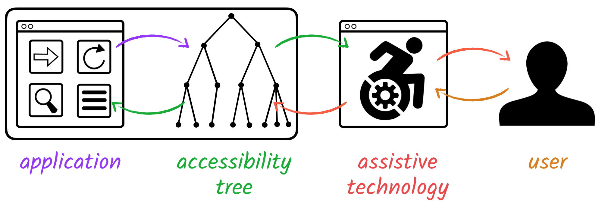

---
# try also 'default' to start simple
theme: apple-basic
layout: intro
# some information about your slides (markdown enabled)
title: 生成AI時代のWebアプリケーションアクセシビリティ改善
mdc: true
fonts:
  sans: Roboto, "Noto Sans JP"
---

<h1 mt="12">生成AI時代の Webアプリケーション アクセシビリティ改善</h1>

<a href="https://vuefes.jp/2025/">Vue Fes Japan 2025</a> | <time datetime="2025-10-25">2025-10-25</time>

  
    やまのく（yamanoku）
  

---
layout: center
---

  

  

  <a href="https://vuefes.jp/2022/sessions/yamanoku">Vue Fes Japan Online 2022</a>での発表資料

  <a href="https://vuefes.jp/2023/sessions/yamanoku">Vue Fes Japan 2023</a>での発表資料

---
layout: statement
---

# 前提：Webアクセシビリティとは？

---
layout: center
---

  

<small>
  出典：間嶋沙知・著 <a href="https://komatta-design.studio.site/">見えにくい、読みにくい「困った！」を解決するデザイン【改訂版】</a> p.20
</small>

---
layout: section
---

## Webアクセシビリティ改善の一例
- 画像への代替となるテキストやラベルを挿入
- カラーコントラストへの配慮
- UIのキーボード操作を可能にする
- フォーカスアウトラインの可視化
- 拡大表示しても画面表示が崩れない
- コンテンツの自動再生をさせない・制御できるようにする
- OSのアクセシビリティ設定から制御できるようになっている
  - 動きの軽減、ハイコントラストモード

---
layout: center
---

# サイトやプロダクトを アクセシブルにする方法を知る

---
layout: statement
---

# WCAG

(Web Content Accessibility Guidelines)

---
layout: section
---

## WCAGとは？

- W3Cが策定するウェブコンテンツのアクセシビリティに関するガイドライン
- 現在の最新版はWCAG 2.2（2024年12月勧告）
  - 次期バージョンのWCAG 3.0は現在策定中
- 4つの原則（知覚可能、操作可能、理解可能、堅牢）に基づき、3つのレベル（A、AA、AAA）で達成基準が定められている
- 多くの国や地域で法的基準のものとして採用されている
  - JIS（日本工業規格）におけるウェブコンテンツのアクセシビリティにまつわる国家規格がJIS X 8341-3:2016

---
layout: center
---

  

<small>
出典：デジタル庁 <a href="https://www.digital.go.jp/resources/introduction-to-web-accessibility-guidebook">ウェブアクセシビリティ導入ガイドブック</a>（2024年3月29日発行）p.16
</small>

---
layout: section
---

## JIS X 8341-3が改正されWCAG 2.2相当になる予定

- WCAG 2.0をベースに2016年に改定されて以来更新がなかった
- 国際規格が今年見直され、WCAG2.2をベースにISO/IEC DIS 40500として2025年9月に規格化
- JIS規格側もこの変更に併せて更新を進めている
  - [JIS X 8341-3の改正に関する準備──ウェブアクセシビリティ基盤委員会 作業部会6 | ウェブアクセシビリティ基盤委員会（WAIC）](https://waic.jp/news/ciaj-column-13/)
- JISの改訂は順調に進めば、[2026年夏ごろに新しいJIS X 8341-3が公示される見込み](https://www.ceatec.com/ja/conference/detail.html?id=3075)
- これからアクセシビリティに取り組む場合は、WCAG2.2をベースとしたものから取り組むことをお勧めする

---
layout: section
---

## Webアクセシビリティ改善のやり方

- WCAGの達成基準に基づき、レベルに合わせた対応方針を策定し改善
- 支援技術を用いてのチェックを実施し改善
- 当事者インタビューを行い問題点を改善
- アクセシビリティ配慮されたデザインシステムを導入 等

<v-click>

準備や運用コストがかかるため、なかなか手が回らないことも多い😫

</v-click>

<v-click>

生成AIを活用してより効率的にアクセシビリティ改善ができないだろうか🤔

</v-click>

---
layout: section
---

# 生成AIを活用して Webアクセシビリティ改善は できるのか

---
layout: section
---

## おことわり

- 2025年10月時点での調査・検証結果の紹介
- モデル性能差によって結果に差異がある可能性はあります
- 独自で検証したものもありケースによっては適応できない可能性もあります
- 主にAIエージェントを活用したコード観点での紹介
  - Figmaなどのデザインツール連携については今回は取り扱わないものとする

---
layout: statement
---

# そもそも AIエージェントは アクセシブルなコードを 書けるのか？ 🙄

---
layout: section
---

## LLMはアクセシブルなコードを生成できるかの研究

  

<small>
  <a href="https://arxiv.org/abs/2503.15885">[2503.15885] Human or LLM? A Comparative Study on Accessible Code Generation Capability</a>
</small>

---
layout: section
---

## LLMによる検証方法

- 現在進行形で更新があり、注目されているOSSのWebサイトソースコードを選定
- コードブロックごとで要約（HTMLは構造タグ、JSは関数やクラスごと、CSSは宣言ブロック）
- 要約内容を元にLLMがコードを再生成する
- 使用したLLMモデルはGPT-4o、Qwen2.5-Coder
- [IBM Equal Access Accessibility Checker (AChecker)](https://github.com/IBMa/equal-access)と[QualWeb Web Accessibility Evaluator (QualWeb)](https://qualweb.di.fc.ul.pt/evaluator/)というツールで評価
  - 他のツールと比較して多くのアクセシビリティ違反を検出できるツール
  - WCAG2.1のルールに基づいたチェック

---
layout: section
---

## 比較するコード生成手法について

<ul>
  <li>Naive: 特にアクセシビリティの指示を与えず単純にコード生成を行う</li>
  <li>Zero-Shot: アクセシビリティに配慮するように指示を出す</li>
  <li>Few-Shot: アクセシビリティにまつわる正誤コード例を提示してから生成を行う</li>
  <li>Self-Criticism: 生成したコードをアクセシブルかレビューし、１回修正を行う</li>
  <v-click><li>FeedA11y</li></v-click>
</ul>

---
layout: section
---

## FeedA11y

- LLMが推論して、再度行動をすることで高い精度が得られるようになる手法
  - Reason-Act（ReAct）と呼ばれるもの
- 生成と分析では別のLLMを使用する
  - 生成側のLLMでアクセシビリティの指示を含めないコードを生成させる
  - 分析側のLLMにコードをレビューさせる
    - ガイドライン、テストルール、スタイルにまつわるコンテキスト情報が必要
- 不備があった場合は生成側にフィードバックを与え、修正を促す
  - 解決するために2～3回の反復

---
layout: center
---

---
layout: section
---

## 結果

<v-click>
FeedA11y、Naive、そのほかの手法の順でアクセシビリティ違反の少ないコードを生成できた
</v-click>

<v-click>

- 人間の書いたコードよりもアクセシブルにすることができた
- ReAct手法によるアクセシビリティ改善が最も効果があった
- 何もアクセシビリティの指示をしないNaive手法が他の指示をつけたものよりも良い結果に
  - HTMLを適切に扱えている、代替テキストの挿入、コントラスト比の調整を対応
- 正誤コード例を提示する手法がもっとも悪い結果となった

</v-click>

<v-click>

<b>
コード生成においてはアクセシビリティに関する指示を含めずに 生成後にレビュー・修正を繰り返す手法が有効
</b>

</v-click>

---
layout: section
---

## レポートフォーマットによってチェックシート生成

  

<small>出典：株式会社Gaudiy <a href="https://speakerdeck.com/maminami373/automating-web-accessibility-testing-with-ai-agents">Automating Web Accessibility Testing with AI Agents</a> p.38</small>

---
layout: section
---

## Accessibility Treeという観点でチェックしてみる

- コードをみるだけでは気づけないこともある
- たとえばスクリーンリーダーでの読み上げが意図したものになっているか
- であれば「表層されたもの」にも注目してみる
- [Playwright MCP](https://github.com/microsoft/playwright-mcp)はAccessibility treeを見て実行する
  - ページ全体でのアクセシブルな名前をチェックしてみる
  - `aria-hidden`によってコンテンツが消えていないかを見る 等
- Chrome DevTools MCPは現時点でAccessibility Treeで確認はできない

---
layout: section
---

## Playwright MCPでのチェック有用性

- 当事者を想定したテストケースに則った操作を検討してくれる
- E2Eテスト観点でアクセシビリティにまつわるチェック指示ができる
- キーボード操作（タブキー遷移）できるかどうか
  - クリックができるかどうか
  - フォーカス順序がどうなっているか

---
layout: section
---

## 当事者のペルソナを設定したテストケースを用意してみる

  

<small><a href="https://github.com/caztcha/Inclusive-Persona-Extension">Inclusive Persona Extension / インクルーシブなペルソナ拡張</a></small>

---
layout: center
class: bg-[#24292e]
---

---
layout: center
class: bg-[#24292e]
---

---
layout: statement
---

# Webアクセシビリティで 最も気をつけるべき点

---
layout: statement
---

# WAI-ARIA

(Web Accessibility Initiative - Accessible Rich Internet Applications)

---
layout: section
---

## WAI-ARIAとは？

  

<small>出典：<a href="https://wicg.github.io/aom/demos/">Accessibility Object Model</a> p.4</small>

---
layout: section
---

## WAI-ARIAを活用しないといけない状況

- HTML要素のみでは表現しきれない場合
  - 複雑なUIを表現する場合
- 動的な通知を行う場合
  - ページ遷移、フォームバリデーション
- UIの状態変化を知らせる場合
- 元のHTML構造を変更できない、リファクタリングなどができない場合
  - サーバーサイド側の出力が制御できない、等
  - WAI-ARIAによって要素の意味合いを変えて補完させる

---
layout: section
---

## 間違ったWAI-ARIAを使わないように指示する

- しかし生成AIはWAI-ARIAを実装をさせると誤った実装が見られることがある
  - コードだけで文脈に沿ったARIAのユースケースまでを理解できていない
  - 正しいARIAの使い方を学習コードとして習得できていない可能性

<v-click>

- 生成AIによる間違ったARIAの使い方を減らしていく
  - `aria-label`で本来伝えたかった情報が上書きされる
  - `aria-hidden`によりコンテンツが意図されずに隠されてしまっている
  - `aria-live`がassertiveとなって通知が差し込まれるようになっていないか
  - `aria-labelledby`で参照するIDが存在しないことがある、等

</v-click>

<v-click>

- WAI-ARIAの仕様書をベースとしたRAGを用意する
- WAI-ARIAの仕様を理解したMCPを活用する

</v-click>

---
layout: section
---

## aria-validate-mcp-server

- aria-queryを活用したARIAのバリデーション用MCPサーバー
- WAI-ARIA 1.2対応のrole、ARIA属性のそれぞれを取得できる
- 対応できる値をチェックできる
  - 要素に対応する属性と値は何か？
  - 使用するARIAとそれに対応するARIAは何か？

[https://github.com/yamanoku/aria-validate-mcp-server](https://github.com/yamanoku/aria-validate-mcp-server)

---
layout: center
class: bg-[#faf9f5]
---

  

---
layout: section
---

## ID属性管理はライブラリのAPIを活用させる

- WAI-ARIAで活用するためのID自体が被ってしまう可能性がある
- 各ライブラリには一意のIDを生成するAPIが搭載されている
  - React: https://ja.react.dev/reference/react/useId
  - Vue.js: https://ja.vuejs.org/api/composition-api-helpers#useid
  - Svelte: https://svelte.jp/docs/svelte/$props#$props.id()
- 事前に活用するようにAGENTs.md、CLAUDE.mdに指示しておく

---
layout: section
---

## baseline-mcp-server

- Baselineの状況を確認できるMCPサーバー
- WAI-ARIAではなく最新のHTML・CSSを活用できるかの知識に活用
- Widelyな技術のみで構成する場合の参考

[https://github.com/yamanoku/baseline-mcp-server](https://github.com/yamanoku/baseline-mcp-server)

---
layout: section
---

## ガードレールとしてのLint＆テスト

- 各種ESLint Plugin、Biome、Oxlintなどでアクセシビリティチェックすることも忘れず
  - React: [eslint-plugin-jsx-a11y](https://github.com/jsx-eslint/eslint-plugin-jsx-a11y)
  - Vue.js: [eslint-plugin-vuejs-accessibility](https://github.com/vue-a11y/eslint-plugin-vuejs-accessibility)
  - Svelte: svelte-check
- HTMLのLintとして[Markuplint](https://markuplint.dev/ja/)も活用
- E2Eテストとして[@axe-core/playwright](https://www.npmjs.com/package/@axe-core/playwright)でのテストケースを活用

---
layout: section
---

## 生成AIによるWebアクセシビリティ改善まとめ

- コード生成においてはアクセシビリティに関する指示を含めなくてもよい
- 代わりに生成後にレビュー・修正を繰り返す促す手法が有効
- 必要なテストケースを理解させ生成AIでテストコードを作成
- Accessibility Treeを見てくれるPlaywright MCPは有用
- RAGやMCPを活用し正しい情報へのアクセスで不備・欠落をなくす
  - トークン消費を抑える工夫も必要
    - Claude Codeであればサブエージェント、Skillsを活用
- ガードレールとしてのLintも忘れずに設定

---
layout: section
---

# おわりに

---
layout: section
---

## DequeのAxe AIによるアクセシビリティチェック

- [Digital Accessibility Innovation with Axe AI | Deque Systems](https://www.deque.com/axe/ai/)
  - axe MCP Server
  - axe Assistant
  - axe DevTools Extension

<v-click>

Deque社が掲げる将来のビジョンは

> **"100% accessibility testing enabled for novices"** 
> **（専門家でなくても100%のアクセシビリティテストを可能にすること）**

と掲げている。
</v-click>

---
layout: section
---

## AIによってアクセシブルになる未来？

- Be My EyesのようにAIと連携することで便利になったものが増えている
- AIにすべてアクセシビリティの問題を任せても良いのでは？

<v-click>

- Web上にあるものがそれに頼る状態のままでよいのだろうか
- チャットUIで他のUIはすべて不要になる？それは本当？
  - AIへ意図通りの指示を出せるのも１つの技能

</v-click>

<v-click>
直接の操作でもAIによる操作でも使える<b>選択肢</b>を用意できるようにすることが重要
</v-click>

---
layout: section
---

## 最終的な人間によるレビューは必要

- LLMの利点は使用するユーザーと対話的をしながら修正を行うことができる点
- Vibe Codingするにしても、内容の見直しや事象の把握は必要
- テストはうまく通ってるが意図通りになっているかわからない場合もある
- だからこそ実際に自らで体験することも忘れない

<v-clicks>

生成されたアウトプットへの責任を持つのは人間

<b>これは「アクセシビリティ」だけに限らない大事な観点</b>

</v-clicks>

---
layout: section
---

## 我々は誰に対して何を提供しているのか、立ち返る

- 生成AIでアクセシビリティ対応を楽にするのはあくまでも手段
- **なぜアクセシビリティをやるのか？** を改めて考えてみる
- その意図を考えるのは人間にしかできないこと
- 「正しいアクセシビリティ」を組織でやっていけるようにする
  - アクセシビリティにまつわる知識を身につける
  - 社会における障害・バリアのことを知っていく
  - [アクセシビリティ成熟度モデル](https://www.w3.org/TR/maturity-model/)で組織の理解度を測る
  - 組織もサイクルを回していけるようにしていく

---
layout: statement
---

<h1>生成AIを武器に アクセシブルなものを 共に作っていこう</h1>

---
layout: section
---

## 発表者：やまのく（yamanoku）

一児の父。会社員。

---
layout: section
---

## 謝辞

### スライド作成にあたり活用したLLMモデル、サービス・ソフトウェア

- Claude Sonnet 4.5, Claude Ops 4, Gemini 2.5 Pro, GPT-5
- NotebookLM, Gemini, Claude Desktop, Claude Code, Codex CLI

### 本スライドのレビュワーの皆様

[haribooooom](https://x.com/haribooooom), [hk_it7](https://x.com/hk_it7), [kubosho](https://x.com/kubosho_), [magi1125](https://x.com/magi1125), [takanorip](https://x.com/takanoripe), [ymrl](https://x.com/ymrl)

---
layout: end
---

# Thank You For Listening !!
