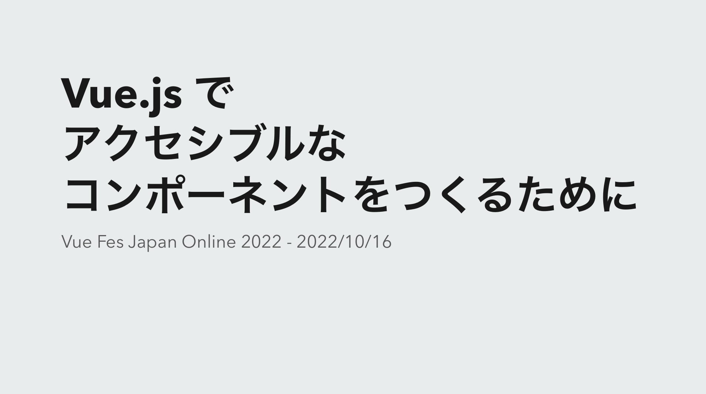

---
# try also 'default' to start simple
theme: apple-basic
layout: intro
# some information about your slides (markdown enabled)
title: 生成AI時代のWebアプリケーションアクセシビリティ改善
mdc: true
fonts:
  sans: Roboto, "Noto Sans JP"
seoMeta:
  ogDescription: yamanokuのVue Fes Japan 2025登壇資料
  ogImage: https://yamanoku.net/vuefes-japan-2025/images/ogp-image-ja.png
  twitterCard: summary_large_image
---

<h1 mt="12">生成AI時代の Webアプリケーション アクセシビリティ改善</h1>

Vue Fes Japan 2025 | <time datetime="2025-10-25">2025-10-25</time>

  
    やまのく（yamanoku）
  

<!--
今年もVue Fes Japan、発表させていただく機会をいただき誠にありがとうございます。
-->

---
layout: center
---

  

  

  <a href="https://vuefes.jp/2022/sessions/yamanoku">Vue Fes Japan Online 2022</a>での発表資料

  <a href="https://vuefes.jp/2023/sessions/yamanoku">Vue Fes Japan 2023</a>での発表資料

<!--
Vue Fes Japanではこれまで2回発表する機会をいただけました。

Vue Fes Japan Online 2022ではVue.jsでアクセシブルなコンポーネントをつくるためにという発表、

Vue Fes Japan 2023では画面遷移から考えるNuxtアプリケーションをアクセシブルにする方法という話をさせていただきました。

今年のVue Fes Japanでは、Vue.jsやNuxtだけに限らない汎用的なWebアクセシビリティ改善手法についてを発表していきたいと思っております。
-->

---
layout: statement
---

# 前提：Webアクセシビリティとは？

<!--
本題に入る前に、まず「Webアクセシビリティ」とは何かという前提を皆さんとで揃えたいと思います。
-->

---
layout: center
---

  

<small>
  出典：間嶋沙知・著 <a href="https://komatta-design.studio.site/">見えにくい、読みにくい「困った！」を解決するデザイン【改訂版】</a> p.20
</small>

<!--
「アクセシビリティ」は、よく「ユーザビリティ」と混同されがちなワードですが、

ユーザビリティが「特定の状況での使いやすさ」を指すのに対し、アクセシビリティは「使える度合いや状況の幅広さ」を指します。

特定のターゲット層だけでなく、高齢者、障害者、初心者、外国人など様々な状況にある人たちの「使えない」状態から「使える」状態に引き上げる、誰もがアクセスできたり使えるようになるがアクセシビリティの目的です。

そしてそれをWebで実現していくことがWebアクセシビリティと呼ばれるものです。
-->

---
layout: section
---

## Webアクセシビリティ改善の一例
- 画像への代替となるテキストやラベルを挿入
- カラーコントラストへの配慮
- UIのキーボード操作を可能にする
- フォーカスアウトラインの可視化
- 拡大表示しても画面表示が崩れない
- コンテンツの自動再生をさせない・制御できるようにする
- OSのアクセシビリティ設定から制御できるようになっている
  - 動きの軽減、ハイコントラストモード

<!--
Webアクセシビリティを実現するために対応できるということは以下のものが挙げられます。

- 画像への代替となるテキストやラベルを挿入
- カラーコントラストへの配慮
- UIのキーボード操作を可能にする
- フォーカスアウトラインの可視化
- 拡大表示しても画面表示が崩れない
- コンテンツの自動再生をさせない・制御できるようにする
- OSのアクセシビリティ設定から動きの軽減、ハイコントラストのカラー調整ができる
-->

---
layout: image
image: 'https://yamanoku.net/vuefes-japan-2025/images/vuefes-japan-2025-site.png'
---

---
layout: center
---

# サイトやプロダクトを アクセシブルにする方法を知る

<!--
このようなアクセシブルにするための方法はいくつかあるのですが、それはどこから知ると良いでしょうか。
-->

---
layout: statement
---

# WCAG

(Web Content Accessibility Guidelines)

<!--
それはWeb Content Accessibility Guidelines、通称WCAGと呼ばれるものです。
-->

---
layout: section
---

## WCAGとは？

- W3Cが策定するウェブコンテンツのアクセシビリティに関するガイドライン
- 現在の最新版はWCAG 2.2（2024年12月勧告）
  - 次期バージョンのWCAG 3.0は現在策定中
- 4つの原則（知覚可能、操作可能、理解可能、堅牢）に基づき、3つのレベル（A、AA、AAA）で達成基準が定められている
- 多くの国や地域で法的基準のものとして採用されている
  - JIS（日本工業規格）におけるウェブコンテンツのアクセシビリティにまつわる国家規格がJIS X 8341-3:2016

<!--
WCAGは、W3Cが策定するウェブコンテンツのアクセシビリティのガイドラインです。

現在の最新勧告版はWCAG 2.2となっております。

4つの原則（知覚可能、操作可能、理解可能、堅牢）と3つの達成基準（A, AA, AAA）が定められています。そこからどのように対応するかについての手法がテクニック集としてまとめられています。

海外では法的基準のものとして採用されていますが、日本では、JIS規格（JIS X 8341-3:2016）が、このWCAGと「技術的に同等」の国家規格として定められています。
-->

---
layout: center
---

  

<small>
出典：デジタル庁 <a href="https://www.digital.go.jp/resources/introduction-to-web-accessibility-guidebook">ウェブアクセシビリティ導入ガイドブック</a>（策定日：2025年10月16日）p.16
</small>

<!--
図にするとこのような形になっています。

現在のJIS規格は図から見てわかる通り2008年に勧告されたWCAG 2.0をベースとしております。2025年現在で約20年前のものを参照しているということで当時とは状況がいくつか変わっているものがあります。

そしてここで重要な点として共有したいのが現在のJIS規格は改正作業が進んでおり、WCAG 2.2をベースにしたものに更新される予定があるということです。
-->

---
layout: section
---

## JIS X 8341-3が改正されWCAG 2.2相当になる予定

- WCAG 2.0をベースに2016年に改定されて以来更新がなかった
- 国際規格が今年見直され、WCAG2.2をベースにISO/IEC DIS 40500として2025年9月に規格化
- JIS規格側もこの変更に併せて更新を進めている
  - [JIS X 8341-3の改正に関する準備──ウェブアクセシビリティ基盤委員会 作業部会6 | ウェブアクセシビリティ基盤委員会（WAIC）](https://waic.jp/news/ciaj-column-13/)
- JISの改訂は順調に進めば、[2026年夏ごろに新しいJIS X 8341-3が公示される見込み](https://www.ceatec.com/ja/conference/detail.html?id=3075)
- これからアクセシビリティに取り組む場合は、**WCAG2.2をベースとしたものから取り組むことがお勧め**

<!--
今年9月に国際規格であるISOがWCAG 2.2をベースにして改訂され、新しいJIS規格は2026年夏ごろに公示される見込みとされています。

ですので、これからWebアクセシビリティに取り組む場合はWCAG 2.2をベースとしてチェックすることをお勧めします。
-->

---
layout: section
---

## Webアクセシビリティ改善のやり方

- WCAGの達成基準に基づき、レベルに合わせた対応方針を策定し改善
- 支援技術を用いてのチェックを実施し改善
- 当事者インタビューを行い問題点を改善
- アクセシビリティ配慮されたデザインシステムを導入 等

<v-click>

準備や運用コストがかかるため、なかなか手が回らないことも多い😫

</v-click>

<v-click>

生成AIを活用してより効率的にアクセシビリティ改善ができないだろうか🤔

</v-click>

<!--
従来の改善方法は、WCAGの達成基準に基づいた方針策定、スクリーンリーダーといった支援技術でのチェック、障害当事者の方たちへのインタビュー、アクセシビリティに配慮されたデザインシステムとして提供するなどがありました。

しかしこれらには始めるための準備に時間がかかり、なかなか手がつけられなかったり、専門家が居ないと進めづらいという現場も多いのではないでしょうか。私自身もその悩みとぶつかることがありました。

そこで、今はもうなくてはならなくなった生成AIを活用し、より効率的なアクセシビリティ改善ができないかということを考えてみました。
-->

---
layout: section
---

# 生成AIを活用した Webアクセシビリティ改善 

<!--
それでは今回の本題でもある「生成AIを活用したWebアクセシビリティ改善」について紹介していきます。
-->

---
layout: section
---

## おことわり

- 2025年10月時点での調査・検証結果の紹介
- モデル性能差によって結果に差異がある可能性はあります
- 主にAIエージェントを活用したコード改善観点での紹介

---
layout: statement
---

# そもそも AIエージェントは アクセシブルなコードを 書けるのか？ 🙄

<!--
どのように改善できるかを考える前に、そもそも生成AIはアクセシブルなコードを書くことができるのか、プロンプトの精度でどれくらい変わるのか？というのが気になりました。
-->

---
layout: section
---

## LLMはアクセシブルなコードを生成できるかの研究

  

<small>
  <a href="https://arxiv.org/abs/2503.15885">[2503.15885] Human or LLM? A Comparative Study on Accessible Code Generation Capability</a>
</small>

<!--
このテーマに関連しそうな情報を探してみたところ、LLMはアクセシブルなコードを生成できるのかを研究した論文が見つかりましたので紹介いたします。

この研究では、人間が書いたコードとLLMが生成したコードとでどちらがアクセシビリティ違反が少ないかを比較・検証してみたものになります。
-->

---
layout: section
---

## LLMによる検証方法

- 現在進行形で更新があり、注目されているOSSのWebサイトソースコードを選定
- コードブロックごとで要約（HTMLは構造タグ、JSは関数やクラスごと、CSSは宣言ブロック）
- 要約内容を元にLLMがコードを再生成する
- 使用したLLMモデルはGPT-4o、Qwen2.5-Coder
- [IBM Equal Access Accessibility Checker (AChecker)](https://github.com/IBMa/equal-access)と[QualWeb Web Accessibility Evaluator (QualWeb)](https://qualweb.di.fc.ul.pt/evaluator/)というツールで評価
  - 他のツールと比較して多くのアクセシビリティ違反を検出できるツール
  - WCAG2.1のルールに基づいたチェック

<!--
対象となったのは現在進行形で更新があり、注目されているOSSのWebサイトのソースコードです。この中にはVue.jsの公式ドキュメントサイトも選ばれています。

LLMがコード生成にするにあたり、ページそのものを見るのではなくコード情報を解析・要約したのちに再生成するような手法をとりました。

違反の検証としてIBMのアクセシビリティチェッカーとQualWebというチェックツールが選ばれました。これは他チェックツールと比較して多くの違反を検出できるものだったからです。ルールはWCAG2.1を基準としてチェックが行われました。
-->

---
layout: section
---

## 比較するコード生成手法について

- Naive: 特にアクセシビリティの指示を与えず単純にコード生成を行う
- Zero-Shot: アクセシビリティに配慮するように指示を出す
- Few-Shot: アクセシビリティにまつわる正誤コード例を提示してから生成を行う
- Self-Criticism: 生成したコードをアクセシブルかレビューし、１回修正を行う

<v-click>

人間のコードとAIによるコード生成はどちらがアクセシブルだったか？

どのプロンプトが一番有用だった？

</v-click>

<!--
プロンプト戦略の出し方についてもいくつかの手法を提案しています。

Naive: 特にアクセシビリティの指示を与えず単純にコード生成を行う

Zero-Shot: アクセシビリティに配慮するように指示を出す

Few-Shot: アクセシビリティにまつわる正誤コード例を提示してから生成を行う

Self-Criticism: 生成したコードをアクセシブルかレビューし、１回修正を行う

皆さんはこれらのプロンプトの中でどれが一番精度が高かったかわかりますでしょうか？
-->

---
layout: section
---

## 結果

<v-click>
人間の書いたコードよりもLLMの生成したコードがアクセシブルになっていた
</v-click>

<v-click>

- <b>何もアクセシビリティの指示をしないNaive手法が他の指示をつけたものよりも良い結果に</b>
- 正誤コード例を提示するFew-Shot手法がもっとも悪い結果となった

</v-click>

<v-click>

- LLMは基本的なHTMLの使い方を熟知しており、最低限正しいマークアップができる、カラーコントラスト比の調整を対応ができた
- アクセシビリティにまつわる内容をコンテキストを含めることで既存のコードベースの構造と衝突し、過剰なアクセシビリティ情報を適用して違反が逆に増えてしまった

</v-click>

<v-click>ここからより精度が高くなる方法はないのか🤔</v-click>

<!--
まず、結果としていずれも人間が書いたコードよりもよりアクセシビリティ違反を下げられる結果となりました、

ですがそれ以上に、非常に重要な示唆が得られましたので紹介します。

実は Naiveの特にアクセシビリティの指示を与えず単純にコード生成を行う という仕組みが最もアクセシビリティ違反が少ないことが示されました。逆に Few-Shotのアクセシビリティにまつわる正誤コード例を提示してから生成を行う が最もアクセシビリティ違反の多い結果となっています。

なぜこのような結果となったのでしょうか。

Naiveでは基本的なWebアクセシビリティ改善、例えばHTMLを活用することやカラーコントラストの整備などは具体的な指示をせずとも行ってくれるようです。

一方、アクセシビリティにまつわる内容をコンテキストを含めることで既存のコードベースの構造と衝突し、過剰なアクセシビリティ情報を適用して違反が逆に増えてしまったというのが挙げられています。

ただ、Naiveの手法があるだけでWebアクセシビリティの問題が改善できているわけではありません。具体的にはSVG要素への名前付けやラベルが一意であるようにするなど、複雑なアクセシビリティ要件には対応しきれていませんでした。

ここからより精度を高める方法はないのでしょうか。
-->

---

## FeedA11y

  

<!--
その問題を解消するために「FeedA11y」という新しい手法を作成しました。これは「Reason-Act（ReAct）」と呼ばれる、LLMが推論と行動を繰り返すプロンプトのフレームワークを活用したものです。

FeedA11yの仕組みについて紹介します。

まず指示内容をもとに「Generator LLM」が、アクセシビリティの指示を含めないクリーンなコードを生成します。

次に「Optimizer LLM」という別のLLMが、そのコードをレビューし、「Accessibility Report」を作成します。

そしてその内容がGeneratorにフィードバックが送られ、修正を促すというこのサイクルを行います。

これを約2〜3回繰り返していきます。
-->

---

## FeedA11y

- LLMが推論して、再度行動をすることで高い精度が得られるようになる手法
  - Reason-Act（ReAct）と呼ばれるもの
- 生成と分析では別のLLMを使用する
  - **Generator LLM**: アクセシビリティの指示を含めないクリーンなコードを生成
  - **Optimizer LLM**: そのコードをレビューしレポートを作成
    - ガイドライン、テストルール、スタイルにまつわるコンテキスト情報が必要
- 不備があった場合はGeneratorにフィードバックを与え、修正を促す
  - このサイクルを約2～3回繰り返す

<v-clicks>

既存のプロンプトよりも最もアクセシビリティ違反が少ない結果を実現することができた

<b>コード生成時にはアクセシビリティの指示を含めず、 生成後にレビューと修正を繰り返す</b>のが重要

</v-clicks>

<!--
流れを再掲するとこのようになります。

これによって既存のプロンプトよりも最もアクセシビリティ違反が少ない結果を出すことに成功しました。

この研究結果から得られる有用な手法としてコード生成時にはアクセシビリティの指示を含めず、生成後にレビューと修正を繰り返すというのが分かりました。
-->

---
layout: section
---

# 生成AIと共に テストケース・レポートを作成

<!--
最初からアクセシブルなコードを生成するよりも入念なレビューをすることが大事、ということがわかったので生成AIを活用してレビューするためのテストケースを作成していきます。
-->

---
layout: section
---

## レポートフォーマットによってチェックシート生成

  

<small>出典：株式会社Gaudiy <a href="https://speakerdeck.com/maminami373/automating-web-accessibility-testing-with-ai-agents">Automating Web Accessibility Testing with AI Agents</a> p.38</small>

<!--
Gaudiyさんの例のようなチェックシートを生成させておくことが有用です。この例ではWCAGの達成基準を元にどのチェックリストが埋められているかを確認できるようになっているようです。

生成AIにWCAGの達成基準を読み込ませて必要なものをリストアップしてもらい独自のチェックシートを生成しておきましょう。
-->

---
layout: section
---

## 当事者のペルソナを設定したテストケースを用意してみる

  

<small><a href="https://github.com/caztcha/Inclusive-Persona-Extension">Inclusive Persona Extension / インクルーシブなペルソナ拡張</a></small>

<!--
さらにテストケースの具体性を高めるために、当事者のペルソナを設定したテストケースを用意した「インクルーシブなペルソナ拡張」というデザイン支援ツールを使ってみてもよいかもしれません。

これはウェブサイトやウェブアプリケーションの設計プロセスにおいて、障害当事者のペルソナのコンテキストを付加することができる資料になっております。

例えば「視覚障害（全盲）」のペルソナについて。彼らの障壁は「視覚情報が理解できない」「スクリーンリーダーが必要」「キーボード操作が必須」などがコンテキストとしてあります。
-->

---
layout: center
class: bg-[#24292e]
---

<!--
このペルソナに基づき、Playwright Agentで生成してもらったテストケースを紹介いたします。

「ページ読み込みと基本ランドマークの存在確認」について、前提や手順・期待結果や成功条件・失敗条件が載っています。

他にもページ内リンクや見出し順序について、文字のぼやけ・重なりを想定した読みやすさについてのテストケースもあります。
-->

---
layout: statement
---

# Webアクセシビリティで 最も気をつけるべき点

<!--
テストケースを作り、実際に改善のサイクルを回していくのですが、Webアクセシビリティの改善において最も気をつけるべき点があります。
-->

---
layout: statement
---

# WAI-ARIA

(Web Accessibility Initiative - Accessible Rich Internet Applications)

<!--
それが WAI-ARIA です。
-->

---
layout: section
---

  

<small>出典：<a href="https://wicg.github.io/aom/demos/">Accessibility Object Model</a> p.4</small>

<!--
WAI-ARIAは、スクリーンリーダーといった支援技術に対してHTMLだけでは表現しきれないアクセシブルな情報を補完する技術仕様です。

ブラウザからDOMツリーとCSSのレンダリングを解析してアクセシビリティに関する情報がアクセシビリティツリーに反映されます。

そして OS ごとのアクセシビリティAPIから支援技術もってユーザーに情報が届きます。

WAI-ARIA はこのアクセシビリティツリーの中で認知できるように意味づけしてあげるという形です。
-->

---
layout: section
---

## WAI-ARIAを活用しないといけない状況

- HTML要素のみでは表現しきれない場合
  - 複雑なUIを表現する場合
- UIの状態変化を知らせる場合
- 動的な通知を行う場合
  - ページ遷移、フォームバリデーション
- 元のHTML構造を変更できない、リファクタリングなどができない場合
  - サーバーサイド側の出力が制御できない、等
  - WAI-ARIAによって要素の意味合いを変えて補完させる

<!--
WAI-ARIAを使う事例として、
HTML要素だけでは表現しきれない複雑なUIやその状態変化、
フォームバリデーションのような動的な通知を行う際に活用します。

また諸事情によりHTML構造が変えられない状況において、上書きすることもあったりします。
-->

---
layout: section
---

## 間違ったWAI-ARIAを使わないように指示する

- 生成AIは複雑なアクセシビリティ要件、特にWAI-ARIAにまつわる実装をさせると誤りが多くなる
  - コードの「文脈」に沿ったARIAのユースケースや実装方法を正しく理解・学習できていない可能性
  - これはWAI-ARIAを正しく理解できていない人間がコードを書く際にも同じような失敗が見られる

<v-click>

- 生成AIによる間違ったARIAの使い方を減らしていく
  - `aria-label`で本来伝えたかった情報が上書きされる
  - `aria-hidden`によりコンテンツが意図されずに隠されてしまっている
  - `aria-live`がassertiveとなって通知が差し込まれるようになっていないか
  - `aria-labelledby`で参照するIDが存在しないことがある、等

</v-click>

<v-click>

- WAI-ARIAの仕様書をベースとしたRAGを用意する
- WAI-ARIAの仕様を理解したMCPを活用する

</v-click>

<!--
さきほどの研究でも紹介がありましたが、生成AIは複雑なアクセシビリティ要件、特にWAI-ARIAにまつわる実装をさせると誤りが多くなります。

これは生成AIがコードの「文脈」に沿ったARIAのユースケースや実装方法を正しく理解・学習できていない可能性があるからです。この誤りはWAI-ARIAを正しく理解できていない人間がコードを書く際にも同じような失敗は見受けられるため、納得できる結果かと思っています。

WAI-ARIA実装で失敗するパターンについてもいくつか紹介していきます。

この誤りへの対策として、WAI-ARIAの仕様書をベースとしたRAGを用意することや、仕様を理解したMCPを活用することが考えられます。

今回はすぐ実践できるMCPサーバーの活用についてを取り上げてみます。
-->

---
layout: section
---

## aria-validate-mcp-server

- aria-queryを活用したARIAのバリデーション用MCPサーバー
- WAI-ARIA 1.2対応のrole、ARIA属性のそれぞれを取得できる
- 対応できる値をチェックできる
  - 要素に対応する属性と値は何か？
  - 使用するARIAとそれに対応するARIAは何か？

[https://github.com/yamanoku/aria-validate-mcp-server](https://github.com/yamanoku/aria-validate-mcp-server)

<!--
正しいWAI-ARIAの情報を取り扱うことのできるARIAバリデーション用MCPサーバーの「aria-validate-mcp-server」を作ってみました。

これはアクセシビリティのESLint Pluginで使用されているaria-queryというライブラリを内部で用いています。WAI-ARIA 1.2の仕様に対応したroleや属性やARIA属性が、どの値を扱えるかをチェックすることができます。
-->

---
layout: center
class: bg-[#faf9f5]
---

  

<!--
これはClaude Desktopで確認した例です。

例えば「checkboxロールが扱える値は？」と聞くと、「必須属性はaria-checkedで、値はtrue,false,mixedです」と、仕様に基づいた正しい答えを返してくれるようになります。

こうした知識をMCPサーバーとして組み込むことで、間違ったARIAの実装を防ぐねらいがあります。
-->

---
layout: section
---

## ID属性管理はライブラリのAPIを活用させる

- WAI-ARIAで活用するためのID自体が被ってしまう可能性がある
- 各ライブラリには一意のIDを生成するAPIが搭載されている
  - React: https://ja.react.dev/reference/react/useId
  - Vue.js: https://ja.vuejs.org/api/composition-api-helpers#useid
  - Svelte: https://svelte.jp/docs/svelte/$props#$props.id()
- 事前に活用するようにAGENTs.md、CLAUDE.mdに指示しておく

<!--
WAI-ARIAを使用する際に必要となるID属性の管理も重要です。これはAIに生成を任せるのではなく、各フレームワークが提供する一意のIDを生成するAPIを活用するように指示するほうが向いています。

React、Vue.js、Svelteにはそれ相当のAPIが存在しています。

これらを活用するよう、AGENTS.mdなどに事前に指示しておきましょう。
-->

---
layout: section
---

## baseline-mcp-server

- Baselineの状況を確認できるMCPサーバー
- WAI-ARIAではなく最新のHTML・CSSを活用できるかの知識に活用
- Widelyな技術のみで構成する場合の参考

[https://github.com/yamanoku/baseline-mcp-server](https://github.com/yamanoku/baseline-mcp-server)

<!--
また「WAI-ARIAを使うべきか、最新のHTML/CSSで対応すべきか」の判断も重要です。

WAI-ARIAはアクセシブルな情報を与える上で重要なものですが、それを使わずにHTML/CSSで表現できることがより重要となってきます。

そのためにモダンブラウザでどのWeb APIが安定して使用できるかを知るBaselineの情報を確認できる「baseline-mcp-server」も作成してみています。

各社プロダクトでの利用環境は異なると思うので、プロダクトごとでの扱うブラウザ範囲と相談しつつ、提示されたHTML/CSSが適応できるかどうかを調べてみてください。
-->

---
layout: section
---

## アクセシビリティツリーという観点でチェックしてみる

- コードをみるだけでは気づけないこともある
- たとえばスクリーンリーダーでの読み上げが意図したものになっているか

<v-click>

- ARIAの状態はアクセシビリティツリーについてから見てみると良い
- [Playwright MCP](https://github.com/microsoft/playwright-mcp)はアクセシビリティツリーを見て実行する
  - ページ全体でのアクセシブルな名前をチェックしてみる
  - `aria-hidden`によってコンテンツが消えていないかを見る 等
- [Chrome DevTools MCP](https://github.com/ChromeDevTools/chrome-devtools-mcp)は現時点でアクセシビリティツリーで確認はできない

</v-click>

<!--
WAI-ARIAを使った場合は実際にアクセシビリティツリーがどう影響しているかをチェックすることも必要です。例えばaria-hiddenによって意図せずコンテンツが消えていないかというのは、状況にもよるためコードだけ見ても良いか悪いかが分かりません。

この内容を確認するためにPlaywright MCPを使用しましょう。Playwright MCPの画期的なものの１つとしてアクセシビリティツリーを見て実行しているという点があげられます。これを活用し、全体のアクセシブルネームがどうなっているか、要素同士の関係性がどうなっているかをチェックすることができます。

ちなみに最近発表されたChrome DevTools MCPにはまだアクセシビリティツリーを読み取る機能が備わっていません。そのためPlaywright MCPを使用することをお勧めします。
-->

---
layout: section
---

## Playwright MCPでのチェック有用性

- 当事者を想定したテストケースに則った操作を検討してくれる
- E2Eテストからアクセシビリティにまつわるチェックができる
- キーボード操作（タブキー遷移）できるかどうか
  - クリックができるかどうか
  - フォーカス順序がどうなっているか 等

<!--
ほかにもPlaywright MCPではキーボード操作（タブキー遷移）でのチェックやフォーカス順序の確認 など、E2Eテスト観点でアクセシビリティのチェック指示が可能なので活用していきましょう。
-->

---
layout: section
---

## ガードレールとしてのLinter＆テスト

- 各種ESLint Plugin、Biome、Oxlintなどでアクセシビリティチェックすることも忘れず
  - React: [eslint-plugin-jsx-a11y](https://github.com/jsx-eslint/eslint-plugin-jsx-a11y)
  - Vue.js: [eslint-plugin-vuejs-accessibility](https://github.com/vue-a11y/eslint-plugin-vuejs-accessibility)
  - Svelte: svelte-check
- HTMLのLintとして[Markuplint](https://markuplint.dev/ja/)も活用
- E2Eテストとして[@axe-core/playwright](https://www.npmjs.com/package/@axe-core/playwright)でのテストケースを活用

<!--
そしてもちろん生成AIだけに頼るのでなく、従来からのガードレール、つまりLinterとテストも設定しておくことが重要です。

Reactであればeslint-plugin-jsx-a11y、Vue.jsであればeslint-plugin-vuejs-accessibility、Svelteはsvelte-check、

出力されたHTMLにはMarkuplint、E2Eテストでは@axe-core/playwrightなどを活用し、生成されたコードの品質チェックをしていきましょう。
-->

---
layout: section
---

## 生成AIによるWebアクセシビリティ改善まとめ

* コード生成時はアクセシビリティ指示を含めず、生成後にレビュー・修正を繰り返す手法（ReAct）が有効
* ペルソナに基づいたテストケースをAIに理解させ、レビューを入念に行う
* 生成AIが苦手なARIAは、RAGやMCPで正しい情報（仕様）を外部から与え、不備をなくす
* アクセシビリティツリーをチェックできるPlaywright MCPは有用
* Linterやテストによるガードレールも忘れずに設定する

<!--
ここまでで発表してきた内容をまとめていきます。

- コード生成時はアクセシビリティ指示を含めず、生成後にレビュー・修正を繰り返す手法（ReAct）が有効
- ペルソナに基づいたテストケースをAIに理解させ、レビューを入念に行う
- 生成AIが苦手なWAI-ARIAは、RAGやMCPで正しい情報（仕様）を外部から与えて不備を減らす
- アクセシビリティツリーをチェックできるPlaywright MCPは有用
- Linterやテストによるガードレールも忘れずに設定する

これらの手法を意識することで、生成AIによる精度の高いWebアクセシビリティ改善が期待できます。ぜひ参考にして明日からの開発に生かしていただきたいです。
-->

---
layout: section
---

# おわりに

<!--
さて、ここまで生成AIを使ってアクセシビリティ改善を効率化する、具体的なテクニックについてお話ししてきました。

最後に生成AIとアクセシビリティに関して私が思うことについてを喋っていこうと思います。
-->

---
layout: section
---

## DequeのAxe AIによるアクセシビリティチェック

- [Digital Accessibility Innovation with Axe AI | Deque Systems](https://www.deque.com/axe/ai/)
  - axe MCP Server
  - axe Assistant
  - axe DevTools Extension

<v-click>

Deque社でのアクセシビリティテストのこれからについて

> **"100% accessibility testing enabled for novices"** 
> **（専門家でなくても100%のアクセシビリティテストを可能にすること）**

を目指している。
</v-click>

<!--
現代のWebアクセシビリティ改善でなくてはならない存在であるaxeの開発するDeque社もアクセシビリティチェックとAIと関連させた「Axe AI」プロジェクトを発表しています。

axe MCPサーバーやAI搭載のaxe DevTools Extension、Slackといったチャットツールと連携してアクセシビリティにまつわる相談ができるaxe Assistantなどが開発されています。

Deque社でのアクセシビリティテストのこれからについては以下のことを目指しています。

「専門家でなくても100%のアクセシビリティテストを可能にすること」

これはテストを100％自動化することではなく、アクセシビリティ改善にかかる時間を短縮し、より仕事をやりやすくすることを目的としています。

このような効率性を考えたツール開発に対して、Webアクセシビリティの改善を考える立場のものとして期待しているところはあります。
-->

---
layout: section
---

## AIに任せればすべてアクセシブルになる？

- AIの進化は凄まじく、AIにすべて任せればアクセシビリティ問題は解決するのでは？
- [Be My Eyes](https://www.bemyeyes.com/ja/)のようにAIと障害当事者への問題解決に関連するプロダクトは存在している
- チャットUIだけあればフロントエンドは不要？

<v-click>

### 本当にそのままでよいのか？
- チャットUIだけでほか全てのUIは不要になるのか？
  - AIへの意図通りの指示にもスキルが必要
  - 自らで触れて操作することで理解につながることもある

</v-click>

<v-click>
AIによって楽になる部分とそうでないものは存在する以上、 
<b>直接の操作でも、AIによる操作でも、使える「選択肢」を用意できること</b>が重要
</v-click>

<!--
AIの進化は凄まじく、AIにすべて任せればアクセシビリティ問題は解決するのでは？と思うかもしれません。実際、Be My EyesのようなAIと障害当事者への問題解決に関連するプロダクトは存在しています。チャットUIによってほか全てのUIは不要になるのではないか、という声も耳にします。

ですが、本当にそのままでよいのでしょうか？

私はチャットUIだけですべてが賄えるとは思いません。AIへの意図通りの指示にもスキルが必要です。また自らで触れて操作することで理解につながるという体験も必要です。

ここで重要となるのは、直接の操作でも、AIによる操作でも、使える「選択肢」を用意できることだと私は考えます。AIによって楽になる部分とそうでないものは存在し続けていくと思います。
-->

---
layout: section
---

## 我々は誰に対して何を提供しているのか、立ち返る

<v-clicks>

- 生成AIでアクセシビリティ改善を楽にすることはあくまでも**手段**
- **なぜアクセシビリティをやるのか？誰に何を提供しているのか？** という**意図**の部分に立ち返る
- この意図を考えるのは、人間にしかできない
- 私たちは生成AIを活用しながら、アクセシビリティに関する正しい知識を身につけていく必要がある
- 組織全体でその改善サイクルを回していけるようにする
  - アクセシビリティにまつわる知識を身につける
  - 社会における障害・バリアのことを知っていく
  - [アクセシビリティ成熟度モデル](https://www.w3.org/TR/maturity-model/)で組織の理解度を測る
  - 組織で学習のサイクルを回していけるようにしていく

</v-clicks>

<!--
今日ご紹介した生成AIのテクニックは、あくまで『手段』としての話です。

私たちが立ち返るべきは、「なぜアクセシビリティをやるのか？」「誰に何を提供しているのか？」という「意図」の部分です。この意図を考えるのは、人間にしかできません。

私たちは生成AIを活用しながら、アクセシビリティに関する正しい知識を身につけていきながら、組織全体でその改善サイクルを回していけるようにする必要があります。
-->

---
layout: statement
---

<h1>生成AIを武器に アクセシブルなものを 共に作っていこう</h1>

<!--
生成AIは、アクセシビリティ改善のハードルを劇的に下げてくれる可能性を秘めています。

この強力な『武器』を手にし、私たち開発者がアクセシビリティの知識と何を作るかの『意図』を持って向き合うことで、真にアクセシブルなWebアプリケーションものへとつながっていくのではないかと思っています。

生成AIを武器に、アクセシブルなものを、ここにいる皆さんと共に作っていきましょう。
-->

---

## 発表者：やまのく（yamanoku）

一児の父。会社員。

---

## 謝辞

### スライド作成にあたり活用したLLMモデル、サービス・ソフトウェア

- Claude Sonnet 4.5, Claude Ops 4, Gemini 2.5 Pro, GPT-5
- NotebookLM, Gemini, Claude Desktop, Claude Code, Codex CLI

### 本スライドのレビュワー

[haribooooom](https://x.com/haribooooom), [hk_it7](https://x.com/hk_it7), [kubosho](https://x.com/kubosho_), [magi1125](https://x.com/magi1125), [takanorip](https://x.com/takanoripe), [ymrl](https://x.com/ymrl)

---
layout: end
---

# Thank You For Listening !!
